# iiecas-kaoyan-bo-docs
[](https://awesome.re)

[](https://creativecommons.org/licenses/by-sa/4.0/)

[](https://t.me/CDKaoYan)
[](https://discord.gg/NePVmmFb2K)
[](https://qm.qq.com/cgi-bin/qm/qr?k=SFhX_Qmtb4o9_2g38lN8_h7PeHLF14m-&jump_from=webapi)
[](https://qm.qq.com/cgi-bin/qm/qr?k=WtzZAwgcSrFU4LgAMovEzpJ6CX57VXbY&jump_from=webapi)

中国科学院信息工程研究所考研保研考博文档资料

National Postgraduate Entrance Exam Documents of Institute of Information Engineering, Chinese Academy of Sciences.

**本文所有数据均为曾公开资料并已作脱敏和隐私保护处理**

Last Modified: 20220808 壬寅七月十一


# 目录

- [简介](#简介)
  - [信息工程创新研究院（中国科学院信息工程研究所）](#信息工程创新研究院中国科学院信息工程研究所)
  - [中国科学院（CAS）简介](#中国科学院cas简介)
  - [中国科学院大学网络空间安全学院（UCAS-SCS）简介](#中国科学院大学网络空间安全学院ucas-scs简介)
  - [中国科学院大学（UCAS）简介](#中国科学院大学ucas简介)
  - [国科大与信工所的关系](#国科大与信工所的关系)
  - [中国科学院大学密码学院与信工所的关系](#中国科学院大学密码学院与信工所的关系)
- [信工所详细情况](#信工所详细情况)
  - [导师情况](#导师情况)
  - [科室情况](#科室情况)
    - [师兄的科室详解](#师兄的科室详解)
    - [UCAS-SCS的科室详解](#ucas-scs的科室详解)
- [夏令营情况](#夏令营情况)
- [推免情况](#推免情况)
- [推免生源详细统计](#推免生源详细统计)
- [考研情况](#考研情况)
- [统考硕士指标详情](#统考硕士指标详情)
- [‼️统考硕士历年分析](#统考硕士历年分析)
- [统考硕士初试科目](#统考硕士初试科目)
- [复试情况](#复试情况)
- [考博情况](#考博情况)
- [人数情况](#人数情况)
- [毕业去向](#毕业去向)
- [常见问题与建议](#常见问题与建议)
- [后记](#后记)
  - [小道消息](#小道消息)
- [贡献及感谢](#贡献及感谢)
- [免责信息](#免责信息)
- [许可](#许可)

---

【抄底學院】【中國大陸計算機考研學士後專班】


> 歡迎加入抄底學院 https://chaodi.edu.kg/ 。 此刻打盹、你將做夢，而此刻抄底、你將圓夢。 聯系< admin@chaodi.edu.kg >申請入學，開通edu郵箱（滑稽）。

> ⭐️ 配套课程【计算机考研复试抄底厚黑学】：https://lixeon.com/courses/ucas-xgs001cd-spring2022

> ⭐️ 2023！硕士统考必看【腾讯文档】中科院信工所考研抄底总群考前摸底【兄弟版】
https://docs.qq.com/sheet/DZG1pQlhIT2tZZlFQ

## Stargazers over time

[](https://starchart.cc/lixeon/iiecas-kaoyan-bo-docs)


***考研meme***


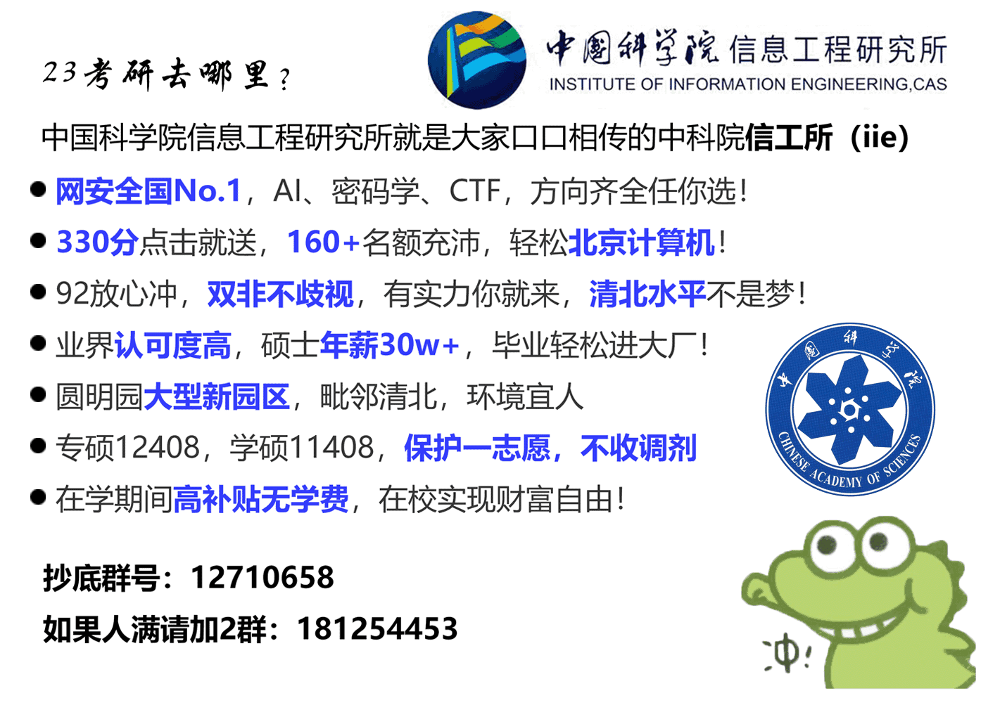

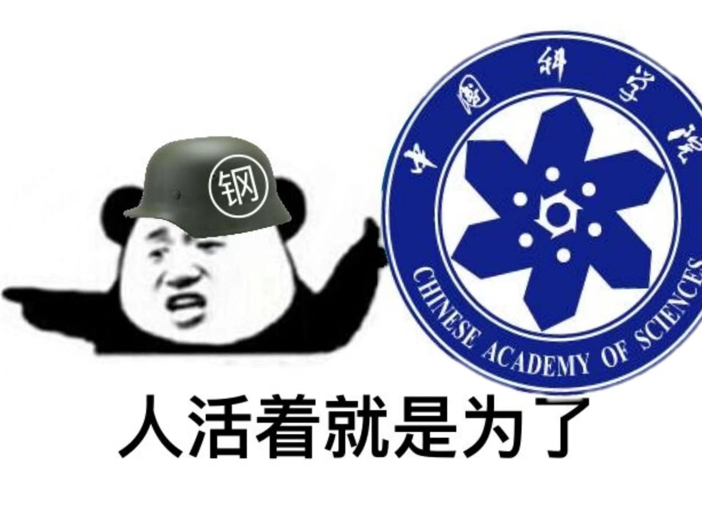


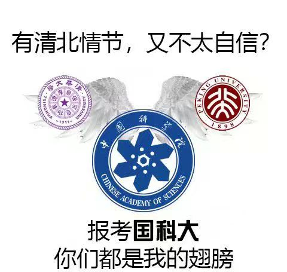

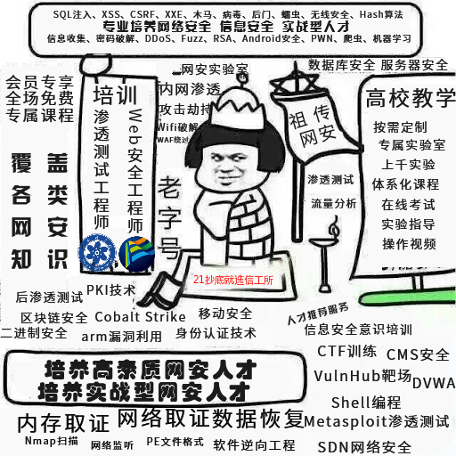


```plain
复试前博弈的这场耻辱性的大败
已经成为了这两天信工所考研最大的话题之一
你说博弈一次一次一次搞了多少次
改过伐啦
换汤不换药啊
人家信工所也有理由说的
我（曾经）带的是什么学生，我带的清华北大啊。
你这批学生是什么学生啊，你叫我带
现在学生什么水平
就这么个成绩
你还在探求什么新的厚黑学抄底方法
而且还要面子，说一个一个发邮件。
它能抄吗？！抄不了，没这个能力知道吗？
再下去（的话）要调剂了
调剂输完去工作，再啃老二战
接下来没学上了
（“另一方面来说他们是备战2023考研最早的学生”）
哦呦，谢天谢地了
我已经说了你这样的（本科）简历本身就没有打好基础
你能跟我保证在考研复试这样关键的时刻它能抄底啊？
务实一点
我劝你们，把自己搞得抄底方法
复试的这个理念先搞懂
你看之前抄底的蛮好的
你一个一个瞎鸡er博弈你搞什么你告诉我
现在搞的直接去调剂了
你到告诉我，怎么解释呢？
（ ）都不要了
```
---


# 简介

**由于信工所发展迅速，人员流动频繁，且以下内容不能保证实时更新，故本文的一些内容可能过时甚至有所误导，请大家自己注意辨别，有问题请向信工所在读学生或老师了解。**


## 信息工程创新研究院（中国科学院信息工程研究所）

以下摘录于《中国科学院年鉴》（2019）：

- 所长：孟丹 
- 地址：北京市海淀区闵庄路甲89号 
- 邮政编码：100093 
- 电话：010-82546510
- 传真：010-82546890 
- 电子信箱：general@iie.ac.cn 
- 网址：http://www.iie.ac.cn

中国科学院信息工程创新研究院（以下简称“信工院”）的前身为中国科学院信息工程研究所（以下简称“信工所”）。信工所于2011年4月经中央编办批准成立，是中国科学院直属科研机构。2014年10月10日，经中国科学院院长办公会议批准，以信工所为主体，开展信息工程创新研究院建设工作。2017年10月27日，中国科学院在北京组织召开信息工程创新研究院建设试点工作专家组验收会。验收专家组认为“信工院面向网络空间安全国家战略需求，定位准确，领域方向布局合理”，同意信工院“全面完成筹建期目标”。2017年12月21日，中国科学院召开第13次院长办公会，对12家于2017年验收的四类机构进行打分评议，决定信息工程创新研究院验收结果为优秀，进入正式运行阶段。

信工院按照“软硬兼修，矛盾兼容，开合有法，张弛有度”的办院方针，秉承“打造一流平台，集聚一流人才，支撑国家需求，引领学科发展，努力成为国家在网络空间安全领域的战略科技力量”的组织目标，在网络与信息安全科技领域，开展基础理论与前沿技术研究，开发应用性技术与系统，为国家信息化进程提供核心关键技术支撑与系统解决方案。

信工院研究方向主要包括：密码理论与安全协议、信息智能处理、大数据安全、通信与电磁技术、网络与系统技术、网络系统评测等。拥有信息安全国家重点实验室、信息内容安全技术国家工程实验室、信息安全共性技术国家工程研究中心三个国家级科研创新平台，中国科学院网络测评技术重点实验室、物联网信息安全技术北京市重点实验室、互联网智能设备安全北京市工程实验室等一批省部级科研创新平台。

截至 2018 年底，信工院共有在职职工775人，其中科技人员690人、科技支撑人员30人，包括研究员及正高级工程技术人员69人、副研 究员及高级工程技术人员159人；共有中国科学院“百人计划”入选者7人。

信工院是2011年国务院学位委员会批准的博士、硕士学位授予权单位之一， 设有计算机科学与技术、信息与通信工程、网络空间安全等3个专业一级学科博士研究生培养点，计算机技术、软件工程等2个专业硕士研究生培养点，并设有计算机科学与技术等1个专业一级学科博士后流动站，共有在学研究生1389人（其中硕士生718人、博士生671人）， 在站博士后13人。

2018年，信工院共有在研项目1025项（新增435项）。主持（或参与）国家重大专项项目2项（新增1项），重点研发计划课题119项（新 增54项）；主持国家自然科学基金项目126项（新增29项）；主持中国科学院战略性先导科技专项与重点项目课题1项，北京市自然科学基金杰出青年科学基金项目1项，国家其他部门科研专项275项（新增23项）及地方其他横向项目502项（新增193项）。

2018年，信工院申报知识产权336项，其中专利268项、软著66项、集成电路布图2项， 获得授权的发明专利共109项。以第一完成单位 获省部级奖项8项，其中一等奖1项，二等奖5项，三等奖2项。2018 年，以信工院为第一完成单位发表中国计算机学会A类和B类国际高水 平长文论文116篇。

2018年，信工院全面铺开成果转化项目，编制成果转化操作手册；“车辆信息安全保密检测云平台 V1.0”科技成果转化入门费 1000 万元到账，确定了科研人员奖励数额及发放方式。注册成立基金管理公司，解决了投资成本控制、持股平台风险、经营决策权控制问题，公司已落实募资5亿元。

2018年，信工院共投资一级企业4家，包括1家全资子公司，即中科信工创新技术（北京）有限公司；3家参股公司，即深圳市金城保密技术有限公司、北京华安保信息技术有限公司、中科信息安全共性技术国家工程研究中心有限公司，全年共实现投资收益218万元。

2018年，信工院因公出访团组数126项，175人次。邀请来访（顺访）团组数68个，108人次。主办或承办国际学术会议3次。

2018年，信工所主办的《信息安全学报》共出版发行 6 期，并被“中国科技核心期刊目录” 收录。英文学术期刊Cybersecurity创刊，共出版3期。


## 中国科学院（CAS）简介

[院况简介](https://www.cas.cn/zz/yk/)


## 中国科学院大学网络空间安全学院（UCAS-SCS）简介

- 学院院长：孟丹
- 网址：https://scs.ucas.ac.cn/

2016年5月7日，中国科学院信息工程研究所牵头，协同中国科学院计算技术研究所、数学与系统科学研究院、声学研究所、计算机网络信息中心、自动化研究所等单位筹建了中国科学院大学网络空间安全学院。

学院秉承“科教融合、育人为本、协同创新、服务国家”的办学理念，面向网络空间安全领域国际前沿与国家发展需要，依托中国科学院信息工程研究所创新平台，发挥中国科学院综合优势，将创新研究与人才培养有机结合，形成科教融合、多学科交叉、产学研用一体化的培养体系，致力于培养理论基础扎实、视野开阔、研发能力强的中、高级多类型专业人才，旨在建设国内顶尖、国际知名的网络空间安全领域专业学院。


## 中国科学院大学（UCAS）简介

[学校简介](https://www.ucas.ac.cn/site/11)


## 国科大与信工所的关系

国科大以“科教融合、育人为本、协同创新、服务国家”为办学理念，与中国科学院直属研究机构（包括所、院、台、中心等，简称“培养单位”）在管理体制、师资队伍、培养体系、科研工作等方面高度融合。

学校由京内四个校区（玉泉路、中关村、奥运村、雁栖湖）、京外五个教育基地（上海、武汉、广州、成都、兰州）和分布在全国的116个培养单位组成。近年来，国科大不断深化科教融合体制机制改革和组织建设，与各培养单位“共建、共治、共享、共赢”。截至2019年12月，学校共有直属教学科研单位58个，其中，京内40个、京外18个；另有附属医院19所。

## 中国科学院大学密码学院与信工所的关系

可以关注微信公众号「中国科学院大学密码学院」了解详情。

# 信工所详细情况

## 导师情况

- 最新导师列表：http://www.iie.cas.cn/yjsjy_101173/dsyd/
- 中国科学院大学导师主页：http://www.ucas.ac.cn/site/77


## 科室情况

### 师兄的科室详解

【重要‼️】来源王道论坛:

http://www.cskaoyan.com/thread-205594-1-1.html

【20220321备份】:
<a href="复试面经/中科院信息工程研究所各个实验室介绍.md">中科院信息工程研究所各个实验室介绍</a>


### UCAS-SCS的科室详解

来源微信公众号：中国科学院大学网络空间安全学院（id: ucas-scs）


<br />

#### 第一研究室

网址：http://www.sklois.cn/

信息安全国家重点实验室筹建于1989年，1991年通过国家验收并正式开放，由中国科学院主管，依托单位为中国科学院信息工程研究所。实验室是我国最早、也是唯一的专门从事信息安全基础理论和关键技术体系化研究的学科类国家重点实验室，是我国该领域核心科研队伍。30年来，实验室在推动我国网络信息安全科技事业发展，培养网络信息安全科技人才，服务国家战略上做出了重要贡献。

截至2020年6月，实验室有固定人员122人，其中，科研人员116人，管理人员6人；正高24人，副高38人，中初级60人。40岁以下科研人员90人，占比73.8%。人员平均年龄35岁。2017年以来，实验室6人获得国家级荣誉和人才项目支持，其中，1人被评为国家网络安全优秀人才（当年全国仅10名），1人被评为国家网络安全优秀教师（当年全国仅10名），1人入选国家“万人计划”领军人才，2人入选国家“万人计划”青年拔尖人才，1人入选国家“优青”，1人入选科技部中青年科技创新领军人才，1人获得北京市自然基金“杰青”项目资助。

目前，实验室有博士研究生导师28人，硕士研究生导师31人，客座导师12人。实验室在读博士研究生257人，在读硕士研究生194人；已培养博士生165人，已培养硕士生202人。

详情见，https://mp.weixin.qq.com/s/H_gPlBTpxrzUnRvnydx0UA


#### 第二研究室

网址：http://nelist.iie.cas.cn/

第二研究室是国家级科研创新基地“信息内容安全技术国家工程实验室”的主体，是国家发展和改革委员会首批批准建设的工程实验室之一，是国家级科研创新基地。原依托于中国科学院计算技术研究所，2012年起依托单位更改为中国科学院信息工程研究所。在网络信息安全与信息智能处理领域有着雄厚的理论基础和丰富的工程实践经验， 为国家网络信息安全战略需求提供技术支撑，为国家重大网络信息安全工程提供技术安全保障，为信息安全技术产业化发展提供有自主知识产权的技术辐射。

研究室拥有实力雄厚的高水平科研及工程队伍，至2020年1月，科研人员328人，学生292人，副高级职称以上30人，是一支年轻、充满朝气的科研团队，自组建以来为我国网络空间安全做出重要贡献。在为国家网络信息安全战略提供支撑的同时，研究室注重高水平人才培养，室里聚集了中国工程院院士方滨兴院士等国内信息安全领域诸多知名专家担任客座导师，有完善的信息安全高层次人才培养体系，注重国际学术交流，力求打造引领学科的国际一流团队。同时，实验室拥有“互联网模拟和仿真研究验证平台”、“海量网络音视频信息研究验证平台”、“网络舆情分析与预警研究验证平台”、“互联网真实网络流实验测试平台”四个一流的国家级互联网信息安全科研实验平台，可为高水平人才培养提供良好的实验环境。


详情见，https://mp.weixin.qq.com/s/BvZZqlJeU_mXXBDumRmIQg


#### 第三研究室

第三研究室全称为大数据安全研究室，是信息工程研究所根据战略发展需要于2018年新成立的科研部门，重点围绕网络空间治理领域开展前沿性基础应用研究、高技术攻关和工程化应用，是培养优秀科技人才、开展学术交流和促进科技成果转化的重要基地。

详情见，https://mp.weixin.qq.com/s/VdFn7MCzRMJNcpVU-8aPOw


#### 第四研究室

第四研究室紧紧围绕“网电空间安全”领域展开研究，不同于传统的信息网络空间，包含物理空间与网络空间在内的网电空间受到前所未有的关注。网电空间安全涉及到万物互连的物理设施及其周围环境所处的物理空间安全、信息网络空间安全、以及携带信息的声光电磁信号空间安全。网电安全问题不仅仅造成信息的窃密或丢失，更大的危害是造成携带信息的无形载体的信号被截获和破坏、有形载体的物理设施与环境的破坏，甚至危及人身安全。研究室科研队伍经过二十多年的发展，在物联网设备安全、声光电磁物理场景安全、无线通信安全、工控系统安全和高安全等级网络与信息系统安全等方向的研究在国内处于领先地位，已成为开展学术交流和促进科研成果转化的重要基地。

截至2020年7月，研究室共有167名职工，平均年龄30岁，是一支朝气蓬勃的队伍。研究室拥有强大的师资力量，包括6名博士生导师，21名硕士生导师，另外聘请10名外单位客座博导。研究室在册研究生 235 名，其中硕士 113 名，博士 122名。2020届毕业生共40名，毕业生主要输送到国家各部委、多所高校和研究院、华为和BAT等企业，以及银行、证券等国内、国际知名企业就职。

详情见，https://mp.weixin.qq.com/s/WWuYvtv22hHh_PCQC9EsSQ


#### 第五研究室

第五研究室成立于2013年，重点在网络与系统安全领域开展基础研究、关键技术研发和应用工程开发等工作，是开展网络与系统安全学术研究科技攻关、学术交流以及人才培养的重要基地。 

研究室的总体目标是面向国家战略需求，研发自主可控和安全可靠的网络技术和计算机系统，为国家重要网络及信息系统建设提供关键技术支撑；重点围绕网络与系统安全开展前沿性和创新性学术研究，跻身国内外相关研究领域前列；积极开展国内外合作交流，着力培养具有国际前沿学术视野和多学科交叉应用能力的研究型人才；同时大力开展创新性研究成果的工程化应用，培养具有网络与系统安全专业知识及系统级软硬件研发技能的专业型人才。 

截至2020年7月，第五研究室有固定研究人员110余人，其中正高级职称10人；副高级职称26人；流动研究人员230余人（包含客座研究人员、博士后、博士研究生、硕士研究生以及客座学生）。

详情见，https://mp.weixin.qq.com/s/Y2EjYTtXf6dNEFHTz7U2ag


#### 第六研究室

第六研究室是信息工程研究所根据战略发展规划于2014年成立的科研部门，重点围绕网络空间安全评测(Cyberspace Risk Assessment）领域开展前沿性基础应用研究、关键技术攻关及工程化应用研发，科教融合，面向网络空间安全研发工作和实战需求，注重基础应用研究型、工程技术研发型和特殊技能型等三型人才培养。目前研究室有员工120余人，在读研究生180余人，有中国科学院网络空间安全评测重点实验室和网络安全防护技术北京市重点实验室两个省部级科研平台及优良的科研实践平台，设置6个科研群组，开展网络空间安全测评相关方向的研究工作，面向国家需求，承担了百余项国家级、院级、省部级重点科研项目和工程研发任务。

详情见，https://mp.weixin.qq.com/s/aM74nXcL3GmD9L_DyPYt2w


# 夏令营情况
| 面向年级 | 计划人数 | 报名人数 | 入营人数 |        时间         |              备注              |
| :------: | :------: | :------: | :------: | :-----------------: | :----------------------------: |
|   2011   |          |          |          |                     |             未举办             |
|   2012   |          |          |          |                     |             未举办             |
|   2013   |   100    |   300    |   100    | 20120723 - 20120729 | 有准推免生（未获推免达线即录） |
|   2014   |   100    |   300    |   100    | 20130721 - 20130727 |                                |
|   2015   |   120    |   400    |   120    | 20140720 - 20140726 |                                |
|   2016   |   130    |   600    |   130    | 20150712 - 20150718 |                                |
|   2017   |   150    |   890    |   150    | 20160717 - 20160723 |                                |
|   2018   |   300    |  1000+   |   300    | 20170709 - 20170723 |                                |
|   2019   |   300    |  1000+   |   300    | 20180708 - 20180721 |                                |
|   2020   |   150    |  1000+   |   152    | 20190714 - 20190720 |                                |
|   2021   |   300    |   1122   |   446    | 20200727 - 20200801 |              线上              |
|   2022   |   500    |   1363  |   500   |       202107中下旬        |        优秀营员人数300+ 分两批次         |


# 推免情况

| 年份 | 计划推免硕士人数 | 计划直博人数 | 推免录取（其中直博） | 985/211/双一流人数 | 985/211/双一流比例 | 男女人数 | 男女比例 |              备注              |
| :--: | :--------------: | :----------: | :------------------: | :----------------: | :----------------: | :------: | :------: | :----------------------------: |
| 2011 |                  |              |                      |                    |                    |          |          |           未独立招生           |
| 2012 |        60        |              |          53          |                    |                    |          |          |                                |
| 2013 |        70        |              |         104          |        101         |       0.971        |          |          | 有准推免生（未获推免达线即录） |
| 2014 |       105        |              |         113          |        104         |       0.920        |  69+44   |  1.568   |                                |
| 2015 |       100        |      40      |      133（40）       |        122         |       0.917        |  82+51   |  1.607   |                                |
| 2016 |       105        |              |                      |                    |                    |          |          |                                |
| 2017 |       160        |              |      207（64）       |        181         |       0.874        |  115+92  |  1.250   |                                |
| 2018 |       210        |              |      260（96）       |        230         |       0.884        |          |          |                                |
| 2019 |       164        |      96      |      252（77）       |        205         |       0.813        |          |          |                                |
| 2020 |       170        |      85      |      193（65）       |        160         |       0.829        |  115+78  |  1.474   |                                |
| 2021 |       170        |              |      204（89）       |        155         |       0.759        |          |          |                                |
| 2022 |                  |              |                      |                    |                    |          |          |                                |


# 考研情况

| 年份 | 计划统考人数 | 报名人数（约数） |   统考分数线    | 统考复试人数 | 达线率 | 实际统考指标（学硕+专硕） | 统考录取（其他计划） | 复录比 | 是否调剂 |             调剂分数线             | 调剂录取 | 国家线（学专一致） | 实际录取 | 录取计划比 |     备注      |
| :--: | :----------: | :--------------: | :-------------: | :----------: | :----: | :-----------------------: | :------------------: | ------ | :------: | :--------------------------------: | :------: | :----------------: | :------: | :--------: | :-----------: |
| 2011 |              |                  |                 |              |        |                           |                      |        |          |                                    |          |                    |          |            |  未独立招生   |
| 2012 |      25      |        20        | 38/38/57/57/320 |      6       | 0.300  |             /             |          4           | 1.500  |    是    |          38/38/57/57/320           |    77    |  38/38/57/57/290   |    81    |   3.240    |               |
| 2013 |      30      |        92        | 40/40/70/70/305 |      38      | 0.413  |             /             |          32          | 1.187  |    是    |          40/40/70/70/310           |    48    |  40/40/60/60/295   | 80（3）  |   2.666    | 3人为准推免生 |
| 2014 |      45      |                  |     国家线      |      73      |        |            55             |          47          |        |    是    |          38/38/75/75/320           |    7     |  38/38/57/57/285   |    54    |   1.200    |               |
| 2015 |      50      |                  | 40/40/80/80/300 |              |        |            57             |                      |        |          |                                    |          |  38/38/57/57/280   |          |            |               |
| 2016 |      45      |                  |     国家线      |              |        |            93             |                      |        |    是    |          50/50/70/70/285           |    47    |  36/36/54/54/265   |          |            |               |
| 2017 |      50      |       232        |     国家线      |     135      | 0.581  |            127            |       82（1）        | 1.646  |    是    | 50/50/70/70/330（业务1+业务2≥180） |    47    |  35/35/53/53/265   |   129    |   2.580    |               |
| 2018 |      60      |       375        | 45/37/65/65/268 |     133      | 0.354  |            106            |       109（3）       | 1.220  |    是    |   50/50/90/90（业务1+业务2≥200）   |          |  34/34/51/51/260   |          |            |               |
| 2019 |     100      |       418        | 39/39/75/75/290 |     135      | 0.322  |        95（41+54）        |          95          | 1.421  |    否    |                                    |          |  39/39/59/59/270   |    95    |   0.950    |               |
| 2020 |     100      |       444        |     国家线      |     204      | 0.459  |            159            |       150（4）       | 1.360  |    是    |          40/40/70/70/300           |    13    |  37/37/55/55/264   |   163    |   1.630    |               |
| 2021 |     100      |                  |     国家线      |              |        |            164            |                      |        |    是    |          40/40/75/75/300           |    21    |  37/37/56/56/263   |          |            |               |
| 2022 |     150      |     800        |     50/38/70/70/300      |     260   |        |            166            |                      |        |        |                     |        |  38/38/57/57/273   |          |            |               |


# 统考硕士指标详情

| 年份 | 计划指标 | 实际指标 | 一室 | 二室 | 三室 | 四室 | 五室 | 六室 |          备注           |
| :--: | :------: | :------: | :--: | :--: | :--: | :--: | :--: | :--: | :---------------------: |
| 2011 |          |          |      |      |      |      |      |      |       未独立招生        |
| 2012 |    25    |          |      |      |      |      |      |      |                         |
| 2013 |    30    |    80    |  16  |  17  |  17  |  17  |  13  |      |                         |
| 2014 |    45    |    54    |  12  |  24  |  7   |  6   |  5   |      |                         |
| 2015 |    50    |    57    |      |      |      |      |      |      |                         |
| 2016 |    45    |    93    |  18  |  24  |  14  |  13  |  18  |  6   |                         |
| 2017 |    50    |   127    |  21  |  17  |  24  |  21  |  28  |  16  |                         |
| 2018 |    60    |   106    |  21  |  31  |  12  |  14  |  21  |  6   |                         |
| 2019 |   100    |    95    |  24  |  30  |      |  17  |  23  |  1   | 此处一室为原一室+原三室 |
| 2020 |   100    |   159    |  49  |  23  |  16  |  30  |  28  |  13  |                         |


# 统考硕士历年分析

## 2011年

未独立招生

## 2012年


## 2013年


## 2014年

各研究室的 录取人数/原定名额/复试人数 为：
一室：     12    12    18
二室：     18    24    40+
三室：     6     7     20+
四室：     6     6     12+
五室：     5     5     15+

## 2015年


## 2016年


## 2017年

一室 一志愿面试22 录取8

五室 一志愿面试28 录取17 有第二志愿 二志愿面试16 录取1


## 2018年

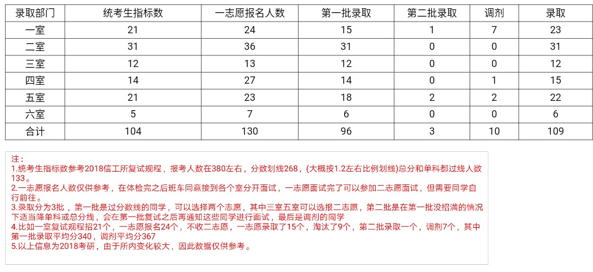

## 2019年

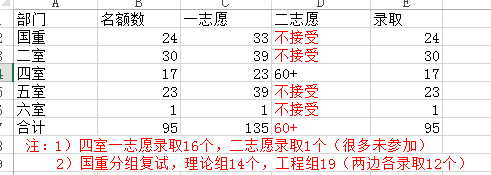

## 2020年


## 2021年


**更加具体和准确的信息请见** 

[2021硕士统考信工所刷高分吗.xlsx](录取情况/2021硕士统考信工所刷高分吗.xlsx)

[2021信工所各个实验室复试的经验帖收集.pdf](复试面经/2021信工所各个实验室复试的经验帖收集.pdf)

## 2022年


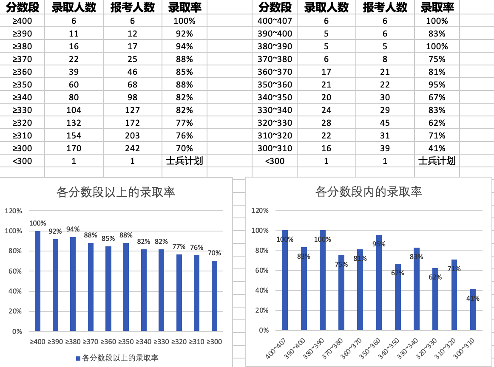

**更加具体和准确的信息请见** 

[2022信工所生源数据及复试经历.pdf](复试面经/2022信工所生源数据及复试经历.pdf)


# 统考硕士初试科目

- 101：思想政治理论
- 201：英语一
- 204：英语二
- 301：数学一
- 302：数学二
- 408：计算机学科专业基础综合
- 863：计算机学科综合（专业）
- 859：信号与系统
- 801：高等代数
- 860：通信原理


| 年份 |              学硕              |           专硕            |    备注    |
| :--: | :----------------------------: | :-----------------------: | :--------: |
| 2011 |                                |                           | 未独立招生 |
| 2012 |        101/201/301/408         |      101/204/302/408      |            |
| 2013 |              同上              | 101/201/302/408或801或860 |            |
| 2014 |              同上              |           同上            |            |
| 2015 |   101/201/301/408或859或860    |           同上            |            |
| 2016 | 101/201/301/863或859或860或801 | 101/201/302/863或801或860 |            |
| 2017 |   101/201/301/863或859或801    |      101/201/302/863      |            |
| 2018 |              同上              |           同上            |            |
| 2019 |              同上              |           同上            |            |
| 2020 |              同上              |           同上            |            |
| 2021 |   101/201/301/408或859或801    | 101/201/302/408或859或801 |            |
| 2022 |     101/201/301/408                     |    101/201/302/408     |            |
| 2023 |     同上                     |    101/201/301/408     |            |


## 公共课

[公共课](初试科目/%E5%85%AC%E5%85%B1%E8%AF%BE/)

[408](初试科目/408%20%E8%AE%A1%E7%AE%97%E6%9C%BA%E5%AD%A6%E7%A7%91%E5%9F%BA%E7%A1%80%E7%BB%BC%E5%90%88/)


## 考古题

[考古题](初试科目/考古题)

[801](初试科目/801%20%E9%AB%98%E7%AD%89%E4%BB%A3%E6%95%B0/)

[863](初试科目/863%20%E8%AE%A1%E7%AE%97%E6%9C%BA%E5%AD%A6%E7%A7%91%E7%BB%BC%E5%90%88%EF%BC%88%E4%B8%93%E4%B8%9A%EF%BC%89/)

[859](初试科目/859%20%E4%BF%A1%E5%8F%B7%E4%B8%8E%E7%B3%BB%E7%BB%9F/)

# 复试情况

参考王道论坛各帖

[信工所各个实验室复试的经验帖收集.pdf](复试面经/信工所各个实验室复试的经验帖收集.pdf)

# 考博情况

|  年份  | 计划人数 | 统考分数线 | 统考录取 | 是否调剂 |           调剂指标            |      调剂分数线       | 调剂录取 |    备注    |
| :----: | :------: | :--------: | :------: | :------: | :---------------------------: | :-------------------: | :------: | :--------: |
|  2011  |          |            |          |          |                               |                       |          | 未独立招生 |
| 2012秋 |          |            |          |    是    |                               | 英语≥59 两门专业课≥60 |          |            |
|  2013  |    75    |            |          |          |                               |                       |          |            |
|  2014  |          |            |          |          |                               |                       |          |            |
|  2015  |          |            |          |          |                               |                       |          |            |
|  2016  |          |            |          |          |                               |                       |          |            |
|  2017  |          |            |          |          |                               |                       |          |            |
|  2018  |          |            |          |          |                               |                       |          |            |
| 2019秋 |          |            |          |    是    | 20（一室6+二室2+四室6+五室6） | 英语≥59 两门专业课≥60 |          |            |
|  2020  |          |            |          |          |                               |                       |          |            |


# 人数情况

| 时间 | 硕士招生数(学硕+专硕) | 博士招生数 | 招生学生总数 | 在册学生数（博士+硕士） | 客座学生数（含联合培养等） | 导师数（客座） |    备注    |
| :--: | :-------------------: | :--------: | :----------: | :---------------------: | :------------------------: | :------------: | :--------: |
| 2011 |                       |            |              |           122           |                            |       80       | 未独立招生 |
| 2012 |      81（67+14）      |     53     |     134      |      243（96+147）      |            150             |    71（30）    |            |
| 2013 |     161（100+61）     |     70     |     231      |                         |                            |       79       |            |
| 2014 |     158（101+57）     |    109     |     267      |                         |                            |                |            |
| 2015 |     152（90+62）      |    105     |     257      |                         |                            |                |            |
| 2016 |     210（119+91）     |    149     |     359      |                         |                            |                |            |
| 2017 |    269（149+120）     |    194     |     463      |     1120（540+580）     |            300             |                |            |
| 2018 |    269（148+121）     |    197     |     466      |                         |                            |      260       |            |
| 2019 |    270（150+120）     |    200     |     470      |                         |                            |                |            |
| 2020 |                       |            |              |          1558           |                            |      249       |            |
| 2021年5月 |      270       |    200    |    470     |          1700+           |                            |      200+       |            |

# 毕业去向

| 年级 | 毕业年份 | 毕业人数 | 就业 | 出国及深造 | 留所 |    备注    |
| :--: | :------: | :------: | :--: | :--------: | :--: | :--------: |
| 2011 |          |          |      |            |      | 未独立招生 |
| 2012 |   2015   |          |      |            |      |            |
| 2013 |   2016   |          |      |            |      |            |
| 2014 |   2017   |          |      |            |      |            |
| 2015 |   2018   |          |      |            |      |            |
| 2016 |   2019   |          |      |            |      |            |
| 2017 |   2020   |          |      |            |      |            |
| 2018 |   2021   |          |      |            |      |            |
| 2019 |          |          |      |            |      |            |
| 2020 |          |          |      |            |      |            |


## 毕业offer详情（模糊）

### 2012级 2015年毕业

美团，豆瓣，移动研究院(北京户口)，木瓜移动(北京户口)

CMU和普渡大学的PhD offer

阿里，百度，搜狗

360，蓝汛

阿里，搜狗

中电29所

阿里，腾讯

人人，搜狗，百度，美团，大众点评

华为，58同城，Vmware，中国电信，交行，银联商务，建行，中证登。

腾讯，小米，阿里

百纳（武汉）信息技术有限公司

雅虎，阿里，百度，美团，雪球

网易游戏，摩根

百度，阿里，腾讯

百度，58同城

启明星辰，乐视TV，移动研究院

阿里，腾讯

深信服

留所

留所

留所

百度，网易彩票

阿里，网易彩票，乐视TV，搜狗，小米

启明星辰，旅游纵横，中电十四所，中科院软件所

绿盟

浪潮，中行，工行，交行


### 2016届四室毕业去向部分

2016年四室毕业生人数32人，硕转博8人，就业24人。 其中，就职银行3人；就职华为，阿里，腾讯等国内著名民企11人； 就职Google ,IBM 2人； 就职移动，联通，电信三大运营商研究院3人。


### 截止2018年1月

截止2018年1月，已毕业研究生500余人，其中在党政机关工作的有10余人，在高校工作的有近30人，在国有大型企业工作的有320余人，在科研单位工作的有100余人。


# 常见问题与建议

1. 我本科双非/rank低/无项目/有没有机会

   > 信工所招生总原则是宁缺毋滥。
   >
   > **坚信一点：只要自己足够努力和优秀，每个老师都喜欢的**

2. 导师问题

   > 中科院实行的都是PI制度，每个PI带领一个课题组，每个课题组的研究方向基本上都是不一样的，所以大家在选导师时结合自己兴趣选择一个自己喜欢的（招生的一般都是PI，能成为PI的都是强人，否则当不了）。
   >
   > 一个老师一般每年招收一个学生，有些刚回国的老师或者比较牛的导师可能名额多点，会招2到3个，每年情况具体分析。

3. 就业问题

   > 见上“毕业去向”节。

4. [徐震老师的建议（2013-07-31）](http://blog.sina.com.cn/s/blog_591e32f10101hgma.html)

   > 计算机相关专业实践性非常强，可现在国内的教育在实践性方面非常不重视。学生在大学几年的学习期间，系统性的研发实践或有挑战的课程设计非常少。于是，大家在面试时一旦被问到工程实践性的问题，大都有些措手不及。这样当然会影响面试的效果，非常可惜。实际上，本科期间大家都有自己电脑，有大把的时间，网上有大把大把的优秀开源项目和技术资源，完全可以扎扎实实做几个很有意思的项目。有了这些经历，完全可以在面试的过程中把相关经历展示出来，从而形成明显的竞争优势。
   >
   > 回头想想 Bill Gates 当年为了上机编程序，能天天不睡觉用学校机房的计算编程。我们现在的条件比那时不知道要好多少倍，不需要等着上机，网上Linux、Apache、Hadoop...那么多优秀的开源项目，可以学习架构、编程。所以，希望大家能够尽早的启动自己的实践历程，找到有意义的项目，去思考、hacking、改进，踏上走向CS高手的征程。

5. 宿舍问题

   > 已基本解决

6. 集中教学问题

   > 信工所学生研一到北京进行为期一年的集中教学，编排到国科大本部的网络空间安全学院。

7. 学位问题

   > **所有中科院下属研究所以及国科大本部的研究生毕业后都是由国科大统一授予毕业证和学位证，上面会注明你所就读的单位。**

8. 学硕和专硕的区别

   > 中科院的学硕和专硕区别不大（高校的区别一般比较大，培养方向和学制以及补助什么的都不同），学制都是三年，进入实验室后做的东西也是一样的，补助也差不多。
   >
   > **区别：在信工所，学硕可以转博、专硕不可以，需要考博。另外，第一年集中教学时培养计划中要求学分略不同，专硕会比学说多几门课（专业英语、知识产权）**

9. 新园区情况

   > 地址：北京市海淀区上地街道树村路19号


# 后记

由于关于信工所的资料相对零散且较为稀少，有关招生宣传方面表现不尽如人意，多为口口相传的传承模式，为了让大家能够更好地了解，故特将一些细节和历年来的文档上传于此。

信工所还很年轻，种种消息或多或少有一些，吾辈仍需努力。

## 小道消息

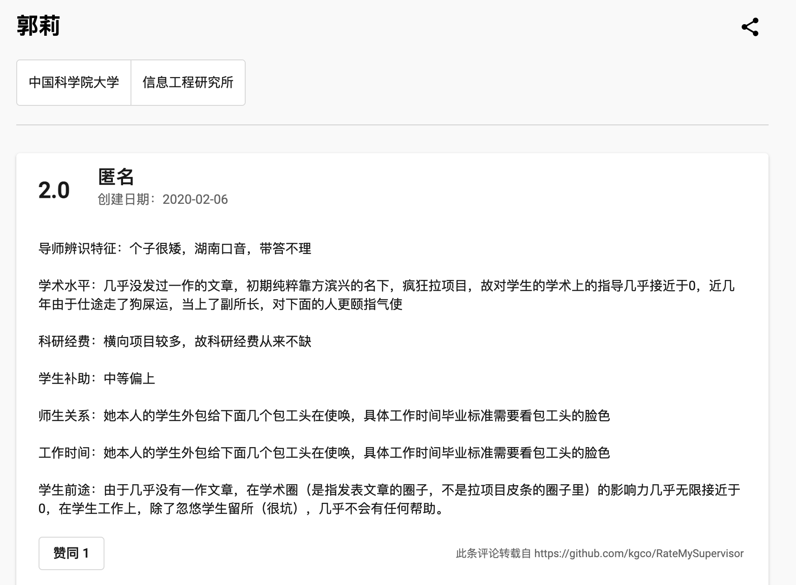


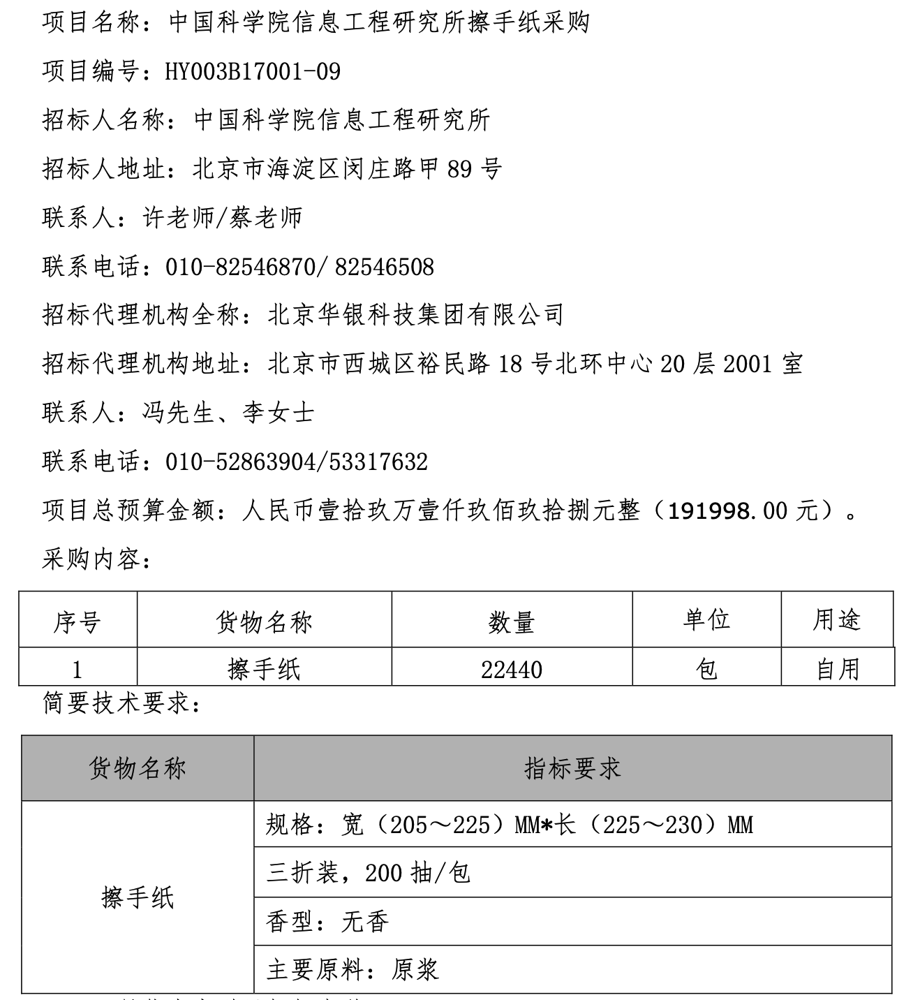

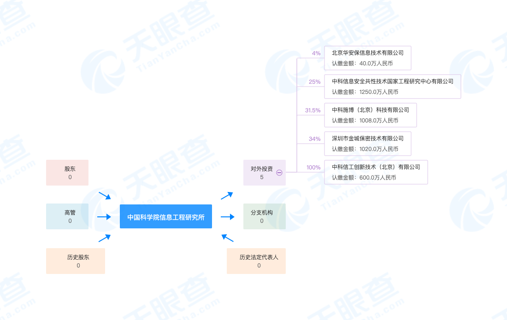

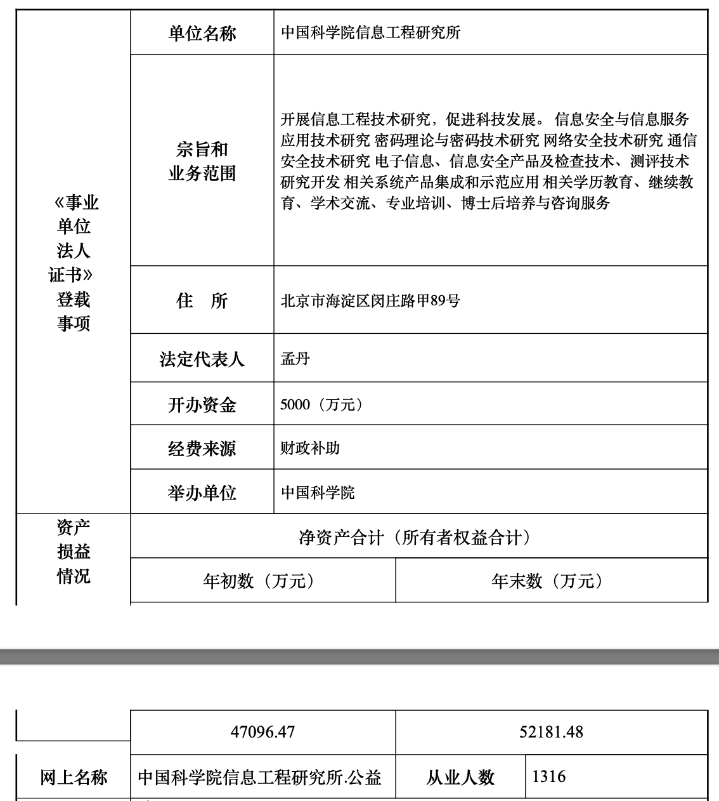


# 贡献及感谢

欢迎各位小伙伴积极指出错误、提出建议和参与贡献，可发issue。

# 免责信息

本repo由 Jing Li（李敬，信工所2020级硕士, &lt;lixeon.lij@gmail.com&gt; ）维护，是为了大家能够更好地客观地全面地了解信工所。几乎所有内容均为互联网公开资料且大部分为原始资料，且均进行了隐私脱敏处理，转载请注明。

# 许可

由贡献者编写部分的许可如下，

<a rel="license" href="http://creativecommons.org/licenses/by-sa/4.0/"></a><br />本作品采用<a rel="license" href="http://creativecommons.org/licenses/by-sa/4.0/">知识共享署名-相同方式共享 4.0 国际许可协议</a>进行许可。

其他部分的版权归属于其各自的作者。资料仅供参考，有一定时效性，请自己判断其适用性。

