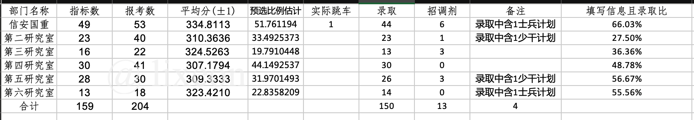
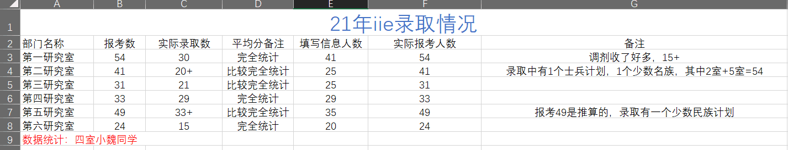
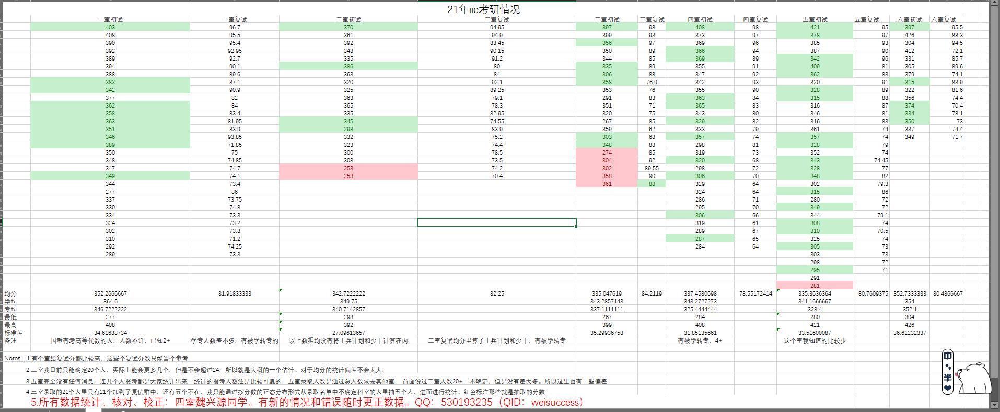

# iiecas-kaoyan-bo-docs

中国科学院信息工程研究所考研保研考博文档资料

National Postgraduate Entrance Exam Documents of Institute of Information Engineering, Chinese Academy of Sciences.

Last Modified: 20220321 壬寅二月十九

> QQ群：总群12710658 二群181254453

> 配套课程【计算机考研复试抄底厚黑学】：https://lixeon.com/courses/ucas-xgs001cd-spring2022.html

> ** ⭐️ 2023！硕士统考必看【腾讯文档】中科院信工所考研抄底总群考前摸底【兄弟版】
https://docs.qq.com/sheet/DZG1pQlhIT2tZZlFQ**

**本文所有数据均为曾公开资料并已作脱敏和隐私保护处理**

# 目录

- [iiecas-kaoyan-bo-docs](#iiecas-kaoyan-bo-docs)
- [目录](#目录)
- [信工所（IIE）简介](#信工所iie简介)
  - [信息工程创新研究院（中国科学院信息工程研究所）](#信息工程创新研究院中国科学院信息工程研究所)
  - [中国科学院（CAS）简介](#中国科学院cas简介)
  - [中国科学院大学网络空间安全学院（UCAS-SCS）简介](#中国科学院大学网络空间安全学院ucas-scs简介)
  - [中国科学院大学（UCAS）简介](#中国科学院大学ucas简介)
  - [国科大与信工所的关系](#国科大与信工所的关系)
  - [中国科学院大学密码学院与信工所的关系](#中国科学院大学密码学院与信工所的关系)
- [信工所详细情况](#信工所详细情况)
  - [导师情况](#导师情况)
  - [科室情况](#科室情况)
    - [师兄的科室详解](#师兄的科室详解)
    - [UCAS-SCS的科室详解](#ucas-scs的科室详解)
      - [第一研究室](#第一研究室)
      - [第二研究室](#第二研究室)
      - [第三研究室](#第三研究室)
      - [第四研究室](#第四研究室)
      - [第五研究室](#第五研究室)
      - [第六研究室](#第六研究室)
- [夏令营情况](#夏令营情况)
- [推免情况](#推免情况)
- [推免生源详细统计](#推免生源详细统计)
- [考研情况](#考研情况)
- [统考硕士指标详情](#统考硕士指标详情)
- [统考硕士历年分析](#统考硕士历年分析)
  - [2011年](#2011年)
  - [2012年](#2012年)
  - [2013年](#2013年)
  - [2014年](#2014年)
  - [2015年](#2015年)
  - [2016年](#2016年)
  - [2017年](#2017年)
  - [2018年](#2018年)
  - [2019年](#2019年)
  - [2020年](#2020年)
  - [2021年](#2021年)
  - [2022年](#2022年)
- [统考硕士初试科目](#统考硕士初试科目)
  - [公共课](#公共课)
  - [408](#408)
  - [考古题](#考古题)
- [复试情况](#复试情况)
- [考博情况](#考博情况)
- [人数情况](#人数情况)
- [毕业去向](#毕业去向)
- [常见问题与建议](#常见问题与建议)
- [新园区情况](#新园区情况)
- [后记](#后记)
- [贡献及感谢](#贡献及感谢)
- [免责信息](#免责信息)
- [许可](#许可)

# 信工所（IIE）简介

**由于信工所发展迅速，人员流动频繁，且以下内容不能保证实时更新，故本文的一些内容可能过时甚至有所误导，请大家自己注意辨别，有问题请向信工所在读学生或老师了解。**

## 信息工程创新研究院（中国科学院信息工程研究所）

以下摘录于《中国科学院年鉴》（2019）：

- 所长：孟丹 
- 地址：北京市海淀区闵庄路甲89号 
- 邮政编码：100093 
- 电话：010-82546510
- 传真：010-82546890 
- 电子信箱：general@iie.ac.cn 
- 网址：http://www.iie.ac.cn

中国科学院信息工程创新研究院（以下简称“信工院”）的前身为中国科学院信息工程研究所（以下简称“信工所”）。信工所于2011年4月经中央编办批准成立，是中国科学院直属科研机构。2014年10月10日，经中国科学院院长办公会议批准，以信工所为主体，开展信息工程创新研究院建设工作。2017年10月27日，中国科学院在北京组织召开信息工程创新研究院建设试点工作专家组验收会。验收专家组认为“信工院面向网络空间安全国家战略需求，定位准确，领域方向布局合理”，同意信工院“全面完成筹建期目标”。2017年12月21日，中国科学院召开第13次院长办公会，对12家于2017年验收的四类机构进行打分评议，决定信息工程创新研究院验收结果为优秀，进入正式运行阶段。

信工院按照“软硬兼修，矛盾兼容，开合有法，张弛有度”的办院方针，秉承“打造一流平台，集聚一流人才，支撑国家需求，引领学科发展，努力成为国家在网络空间安全领域的战略科技力量”的组织目标，在网络与信息安全科技领域，开展基础理论与前沿技术研究，开发应用性技术与系统，为国家信息化进程提供核心关键技术支撑与系统解决方案。

信工院研究方向主要包括：密码理论与安全协议、信息智能处理、大数据安全、通信与电磁技术、网络与系统技术、网络系统评测等。拥有信息安全国家重点实验室、信息内容安全技术国家工程实验室、信息安全共性技术国家工程研究中心三个国家级科研创新平台，中国科学院网络测评技术重点实验室、物联网信息安全技术北京市重点实验室、互联网智能设备安全北京市工程实验室等一批省部级科研创新平台。

截至 2018 年底，信工院共有在职职工775人，其中科技人员690人、科技支撑人员30人，包括研究员及正高级工程技术人员69人、副研 究员及高级工程技术人员159人；共有中国科学院“百人计划”入选者7人。

信工院是2011年国务院学位委员会批准的博士、硕士学位授予权单位之一， 设有计算机科学与技术、信息与通信工程、网络空间安全等3个专业一级学科博士研究生培养点，计算机技术、软件工程等2个专业硕士研究生培养点，并设有计算机科学与技术等1个专业一级学科博士后流动站，共有在学研究生1389人（其中硕士生718人、博士生671人）， 在站博士后13人。

2018年，信工院共有在研项目1025项（新增435项）。主持（或参与）国家重大专项项目2项（新增1项），重点研发计划课题119项（新 增54项）；主持国家自然科学基金项目126项（新增29项）；主持中国科学院战略性先导科技专项与重点项目课题1项，北京市自然科学基金杰出青年科学基金项目1项，国家其他部门科研专项275项（新增23项）及地方其他横向项目502项（新增193项）。

2018年，信工院申报知识产权336项，其中专利268项、软著66项、集成电路布图2项， 获得授权的发明专利共109项。以第一完成单位 获省部级奖项8项，其中一等奖1项，二等奖5项，三等奖2项。2018 年，以信工院为第一完成单位发表中国计算机学会A类和B类国际高水 平长文论文116篇。

2018年，信工院全面铺开成果转化项目，编制成果转化操作手册；“车辆信息安全保密检测云平台 V1.0”科技成果转化入门费 1000 万元到账，确定了科研人员奖励数额及发放方式。注册成立基金管理公司，解决了投资成本控制、持股平台风险、经营决策权控制问题，公司已落实募资5亿元。

2018年，信工院共投资一级企业4家，包括1家全资子公司，即中科信工创新技术（北京）有限公司；3家参股公司，即深圳市金城保密技术有限公司、北京华安保信息技术有限公司、中科信息安全共性技术国家工程研究中心有限公司，全年共实现投资收益218万元。

2018年，信工院因公出访团组数126项，175人次。邀请来访（顺访）团组数68个，108人次。主办或承办国际学术会议3次。

2018年，信工所主办的《信息安全学报》共出版发行 6 期，并被“中国科技核心期刊目录” 收录。英文学术期刊Cybersecurity创刊，共出版3期。

## 中国科学院（CAS）简介

   1949年，伴随着新中国的诞生，中国科学院成立。

　　作为中国自然科学最高学术机构、科学技术最高咨询机构、自然科学与高技术综合研究发展中心，中国科学院建院以来时刻牢记使命，与科学共进，与祖国同行，以国家富强、人民幸福为己任，人才辈出，硕果累累，为我国科技进步、经济社会发展和国家安全做出了不可替代的重要贡献。

　　成立之初，在中央的支持下，中国科学院迅速凝聚了一批海内外优秀科学家，组建了高水平的研究机构，在“向科学进军”中发挥了先导和主力军作用。改革开放以来，率先打开与西方国家科技合作的大门，率先实行所长负责制、开放实验室，率先设立面向全国的科学基金。创办了联想集团等一大批高新技术企业，推动科研成果转化为现实生产力，发挥了改革先行者的作用。世纪之交，面对知识经济时代的机遇和挑战，提出建设国家创新体系的构想，实施知识创新工程和“创新2020”，凝练科技创新目标，调整重大科技布局，创新科研组织模式，建立现代院所制度，各项事业快速发展，创新能力显著提升，创新成果不断涌现，提升了中国在国际科技界的影响力，具备了引领我国科技实现跨越发展的基础和优势。在新时期新阶段，作为党、国家、人民可以依靠、可以信赖的国家战略科技力量，中国科学院深入实施“率先行动”计划，正在面向世界科技前沿，面向国家重大需求，面向国民经济主战场，努力实现“四个率先”目标，即“率先实现科学技术跨越发展，率先建成国家创新人才高地，率先建成国家高水平科技智库，率先建设国际一流科研机构”。

　　建院以来，中国科学院服务国家战略需求和经济社会发展，始终围绕现代化建设需要开展科学研究，产生了许多开创性科技成果，奠定了新中国的主要学科基础，自主发展了一系列战略高技术领域，形成了具有中国特色的科研体系，带动和支持了我国工业技术体系、国防科技体系和区域创新体系建设。

　　——从“两弹一星”到载人航天和探月工程以及载人深潜、深渊科考关键核心科技问题的攻克，为国家安全和战略科技任务做出了重大贡献。

　　——从成功研制第一台计算机、曙光超级计算机、龙芯系列通用芯片，到单精度千万亿次超级计算系统、寒武纪人工智能处理器，在我国计算机技术自主创新中发挥了骨干作用。

　　——从发出中国第一个电子邮件，到建立中国互联网信息中心、中国网通与无线传感试验网，成为网络科技和网络产业的开拓者。

　　——从顺丁橡胶工业生产新技术，到煤制乙二醇技术、甲醇制烯烃技术、煤合成油技术、煤制烯烃技术及工业化应用，不断开辟我国化学工业的新方向和生长点。

　　——从陆相成油理论，到海相成油的探索，为我国摘掉贫油帽子、大规模开发油气田提供了科学理论支持。

　　——从自主研制的氯霉素、青霉素，到原创的青蒿素合成、丹参多酚酸盐、盐酸安妥沙星，在我国药物自主创新方面走在了前列。

　　——从开创中国海洋养殖业，到黄淮海中低产田改造，到生物育种，引领了我国高新农业科技的发展。

　　——从在世界上首次完成人工合成牛胰岛素，到首次证明诱导多能干细胞、人类基因测序、首次实现体细胞克隆猴，在生命科学领域取得了重要原创成果。

　　——从开创数学机械化证明、有限元方法，到多元复变函数论、辛几何、哥德巴赫猜想研究方面登上世界数学的高峰，奠定了数学研究国家科学中心的地位。

　　——从北京正负电子对撞机，到建成上海光源、“中国天眼”FAST等一批大科学装置，打造了多学科创新的重要平台。

　　——从铁基超导纪录刷新，到中微子振荡模式、量子通信、量子反常霍尔效应、三重简并费米子的研究，在物理学领域不断实现新的突破。

　　——从暗物质卫星“悟空”发射成功，到我国首颗X射线天文卫星“慧眼”遨游太空，推动我国空间科学研究走向世界前沿。中国科学院率先建立研究生制度，成立中国科学技术大学，建立新中国第一家研究生院，率先实行学位制，率先建立博士后制度。实施知识创新工程、“创新2020”以来，高质量规模化发展研究生教育，形成了以中国科学技术大学和中国科学院大学（原中国科学院研究生院）为核心、覆盖全院研究所的教育体系，形成了独具特色的两段式研究生教育模式，研究生教育质量不断提高。

　　建院以来，先后由郭沫若（1949～1978）、方毅（1979～1981）、卢嘉锡（1981～1987）、周光召（1987～1997）、路甬祥（1997～2011）、白春礼（2011～2020）和侯建国（2020至今）担任院长，他们为中国科学院的建立与发展做出了卓越贡献。全国先后有1400余位科学家当选为中国科学院院士，他们是新中国科技工作者的杰出代表。中国科学院汇聚和造就出一大批为新中国科技事业做出重大贡献的科学家，其中代表人物有“两弹一星元勋”于敏、王大珩、王希季、王淦昌、邓稼先、朱光亚、孙家栋、任新民、吴自良、陈芳允、陈能宽、杨嘉墀、周光召、赵九章、钱骥、钱三强、钱学森、郭永怀、屠守锷、黄纬禄、程开甲、彭桓武，国家最高科技奖获得者吴文俊、王选、黄昆、刘东生、叶笃正、吴孟超、李振声、闵恩泽、吴征镒、徐光宪、谷超豪、孙家栋、师昌绪、谢家麟、吴良镛、郑哲敏、张存浩、程开甲、于敏、赵忠贤、刘永坦、曾庆存、顾诵芬、王大中，新中国主要学科的奠基人和开拓者华罗庚、苏步青、吴有训、周培源、严济慈、庄长恭、曾昭抡、张钰哲、竺可桢、贝时璋、童第周、冯德培、钱伟长、李薰、周仁等，还有冯康、王应睐、陈景润等一批勇攀世界科技高峰的杰出科学家，以及南仁东、王逸平等“时代楷模”。中国科学院立足创新实践，吸引凝聚和培养造就了一大批战略科学家、科技领军人才、青年人才和高水平创新团队，形成了一支高水平的科技创新队伍，700余人在重要国际科技组织担任职务。同时向社会输送了大批高素质创新创业人才。成建制向国防部门、工业部门、行业、地方、大学等输送了大批科技人才，有力支持了我国科研体系的形成与发展。涌现出一批高科技企业的创业者和企业家。

　　中国科学院学部和广大院士，团结带领全国科技工作者，围绕国家经济建设、社会发展、国家安全和科技进步的重大问题，开展科技咨询和评议，有力地支持了国家宏观决策，充分发挥了国家在科学技术方面最高咨询机构的作用，组织和动员全国科学家制定国家十二年远景规划，提出实施“863”计划、建立科学基金制度、跟踪研究外国战略性高技术发展、建立中国工程院、发展我国先进核能、建设可持续能源体系等一系列重大建议。中国科学院构建了学部与实体有机结合的战略研究体系，持续深入分析世界科技发展大势，前瞻思考中国经济社会发展和科技进步，提出了《迎接知识经济时代，建设国家创新体系》、《创新促进发展，科技引领未来》、《创新2050：科学技术与中国的未来》、《科技发展新态势与面向2020年的战略选择》等战略研究报告，在国家发展的关键时期提出了应对挑战的系统科学建议和系统解决方案，从而引领了中国科技发展的方向。

　　如今的中国科学院，集科研院所、学部、教育机构于一体，确立了“民主办院、开放兴院、人才强院”的发展战略，以及“三个面向”“四个率先”的办院方针。全院共拥有11个分院、100多家科研院所、3所大学（与上海市共建上海科技大学）、130多个国家级重点实验室和工程中心、68个国家野外观测研究站、20个国家科技资源共享服务平台，承担30余项国家重大科技基础设施的建设与运行，正式职工6.9万余人，在学研究生7.9万余人。建成了完整的自然科学学科体系，物理、化学、材料科学、数学、环境与生态学、地球科学等学科整体水平已进入世界先进行列，一些领域方向也具备了进入世界第一方阵的良好态势。在解决关系国家全局和长远发展的重大问题上，已成为不可替代的国家战略科技力量。一批科学家在国家重大科技任务中发挥了关键和中坚作用，并作为我国科技界的代表活跃在国际科技前沿。

　　在实施创新驱动发展战略、建设创新型国家的新时期，中国科学院启动实施“率先行动”计划，正以高度的责任感和紧迫感、自觉性和坚定性，贯彻“立足当前，着眼未来，既面向国家重大需求做出创新贡献，又面向世界科技前沿追求学术卓越，以深化改革促进创新发展，以重点突破带动整体跨越”的指导思想，前瞻谋划，系统设计，积极思变，主动改革，以点带面，蹄疾步稳，努力实现“四个率先”的目标。

　　着眼国家“两个一百年”的战略目标，“率先行动”计划将实施“两步走”发展战略：

　　第一步是到2020年左右，即建党100年时，高质量完成“创新2020”各项任务，基本实现“四个率先”目标，在我国实施创新驱动发展战略、建设创新型国家中发挥国家战略科技力量应有的骨干引领作用。

　　第二步是到2030年左右，全面实现“四个率先”目标，为在新中国成立100年，也是中科院成立100年时，把我国建成世界科技强国奠定坚实基础，为实现中华民族伟大复兴的中国梦提供有力支撑。

　　（2021年11月更新）

## 中国科学院大学网络空间安全学院（UCAS-SCS）简介

- 学院院长：孟丹
- 网址：https://scs.ucas.ac.cn/

2016年5月7日，中国科学院信息工程研究所牵头，协同中国科学院计算技术研究所、数学与系统科学研究院、声学研究所、计算机网络信息中心、自动化研究所等单位筹建了中国科学院大学网络空间安全学院。

学院秉承“科教融合、育人为本、协同创新、服务国家”的办学理念，面向网络空间安全领域国际前沿与国家发展需要，依托中国科学院信息工程研究所创新平台，发挥中国科学院综合优势，将创新研究与人才培养有机结合，形成科教融合、多学科交叉、产学研用一体化的培养体系，致力于培养理论基础扎实、视野开阔、研发能力强的中、高级多类型专业人才，旨在建设国内顶尖、国际知名的网络空间安全领域专业学院。

## 中国科学院大学（UCAS）简介

中国科学院大学简称“国科大”，是一所以科教融合为办学模式、研究生教育为办学主体、精英化本科教育为办学特色的创新型大学。

国科大的研究生教育，发端于中国科学院的人才培养。1950 年，中国科学院启动研究实习员的招考和培养工作。1951年6月，中国科学院与中央教育部联合发布《中国科学院所属研究机构、中央教育部所属高等学校研究部一九五一年暑期招收研究实习员、研究生办法》。1955年8月，《中国科学院研究生暂行条例》由周恩来总理签发后颁布实施。1964年9月，中国科学院在北京试办“中国科学院研究生院”。

1977年，中国科学院率先恢复研究生招生，为适应各研究所招收和培养研究生的需要，在北京成立了中国科学技术大学研究生院。1978年，恢复招生后的首批研究生入学。1982年，中国科学院党组批准研究生院同时使用“中国科学院研究生院”、“中国科学技术大学研究生院”两个名称。2000年12月，学校更名为中国科学院研究生院。2005年，中国科学院管理干部学院并入中国科学院研究生院。2012年6月，中国科学院研究生院更名为中国科学院大学，并于2014年开始招收本科生，形成了覆盖本、硕、博三个层次的高等教育体系。

截至2020年12月，国科大有专任教师3091名，其中两院院士178人；各培养单位在岗研究生指导教师12859人，其中博士生导师7276人（含中国科学院院士232人、中国工程院院士39人）。

截至2020年12月，国科大有在学本科生1645名；在学研究生5.42万名，其中博士生占近52%；在学外国留学生1751人，其中外国博士生1088人，外国博士生数量位居全国高校前列。

国科大以“科教融合、育人为本、协同创新、服务国家”为办学理念，与中国科学院直属研究机构（包括所、院、台、中心等，以下简称“培养单位”）在管理体制、师资队伍、培养体系、科研工作等方面高度融合。学校由京内四个校区（玉泉路、中关村、奥运村、雁栖湖）、京外五个教育基地（上海、武汉、广州、成都、兰州）和分布在全国的116个培养单位组成。近年来，国科大不断深化科教融合体制机制改革和组织建设，与各培养单位“共建、共治、共享、共赢”。截至2020年12月，学校共有直属教学科研单位64个。

国科大是中国科学院“率先建成国家创新人才高地”任务的重要承担者，是完成“出成果、出人才、出思想”战略使命的重要依托。学校的核心使命是利用科教融合平台，遴选中国科学院最优质教育教学资源，提供给研究生和本科生，培养造就德才兼备的科技创新创业人才，为国家的创新驱动发展服务，为人类的文明进步做出贡献。截至2020年12月，国科大已经累计授予183488名研究生硕士、博士学位，授予966名本科毕业生学士学位。国科大培养了新中国第一个理学博士、第一个工学博士、第一个女博士、第一个双学位博士，培养了全国约四分之一的“杰出青年基金获得者”。自1978年建校以来，所培养的学生有137名当选为两院院士。

国科大始终秉承中国科学院的育人传统，坚持在高水平科研实践中培养创新创业人才，在学研究生已经成为国家科技创新的生力军，中国科学院的重大成果和产出都有他们的付出和贡献。截至2020年12月，分布在各研究生培养单位的23个国家重大科技基础设施、两个国家研究中心、73个国家重点实验室、191个中国科学院重点实验室、8个国家工程研究中心、17个国家工程技术研究中心、14个国家工程实验室，以及众多国家级前沿科研项目，为学生培养提供了世界一流的科研创新实践平台。

国科大拥有丰富的文献资源和现代化的教学条件。国科大共有、共享中国科学院文献情报中心的资源，文献情报中心拥有丰富的馆藏资源和电子文献，同时学生也可在中国科学院各分院、各研究所以及国科大雁栖湖校区、玉泉路校区的图书馆，使用各类资源和服务。

国科大教学设施优良，全面应用多媒体、网络视频教育等现代化教学手段。国科大狠抓教学质量，严格教学管理，加强师资队伍建设，出版了大量高水平的专业教材。

国科大拥有完备的学科体系。截至2020年12月，共有博士学位授权一级学科点43个，分布在教育学、历史学、理学、工学、农学、医学、管理学7个学科门类；硕士学位授权一级学科55个，分布在哲学、经济学、法学、教育学、文学、理学、工学、农学、医学、管理学10个学科门类。此外，国科大还拥有金融、应用统计、应用心理、翻译、电子信息、机械、材料与化工、资源与环境、能源动力、土木水利、生物与医药、农业、药学、工商管理、公共管理、工程管理16类专业学位授权点。在保持自然科学领域学科优势的同时，国科大近年来不断加强应用学科、新兴交叉学科以及人文、社会科学学科的建设，在管理学、哲学、医学、心理学、经济学、法学等学科的实力也逐渐显现。学校现有本科专业15个，博士后流动站116个。

国科大是国务院学位委员会首批授权学位自主审核的20所高校之一。根据全国第四轮学科评估结果，国科大30个学科被评为A类，其中A+学科18个。在2021年5月公布的ESI（Essential Science Indicators）最新数据中，国科大国际排名49位，位列内地高校第一位。在全部22个学科排名中，国科大材料科学和化学学科跻身ESI前万分之一行列；材料科学、化学、环境科学与生态学、工程、植物和动物科学、农业、地球科学7个学科进入ESI前千分之一，18个学科进入ESI前百分之一学科。

以中国科学院丰富的科教资源和强大的国际合作平台为依托，国科大开展形式多样、内容丰富的国际学术合作和师生交流工作，不断提升学校国际学术声誉和国际影响力。目前，国科大已与美国哈佛大学、麻省理工学院、哥伦比亚大学、斯坦福大学，英国剑桥大学、布里斯托大学，德国慕尼黑工业大学，澳大利亚国立大学，法国索邦大学、巴黎科学艺术与人文大学，加拿大多伦多大学，新加坡国立大学等世界一流高校和英国皇家科学院、德国马普学会、法国国家科研中心、美国科学院等国际知名科研机构建立了密切联系与合作交流关系。依托中国科学院海外科教中心，建设国科大海外联合科教中心，已在斯里兰卡、缅甸、乌兹别克斯坦举行挂牌仪式，为与“一带一路”国家开展科技创新合作、培养高层次人才提供了平台。国科大是环太平洋大学联盟（APRU）成员高校、中国教育国际交流协会“双一流”建设高校国际交流分会副会长单位及中澳一流大学合作机制首批加盟大学。

在中国科学院和丹麦科教部的支持下，国科大与8所丹麦大学联合创建了教育科研创新相融合的“中丹中心”，并成立了中外合作办学机构——“中丹学院”。联合国家自然科学基金委员会和国际理论物理中心（ICTP），建设联合国教科文组织（UNESCO）下的“国际理论物理中心（亚太）”。得到美国卡弗里（Kavli）基金会支持，建立国科大卡弗里研究所，成为当今世界上20所卡弗里研究所成员之一。

国科大积极推进共建“一带一路”教育行动工作，参与 “中国科学院发展中国家科教合作拓展工程”建设，实施“‘一带一路’国际科学组织联盟（ANSO）奖学金计划”和“中国科学院‘一带一路’硕士生奖学金”等计划，培养外国高层次青年科技人才。

“两弹一星”精神是国科大文化的历史根基和精神脉络。学校不仅注重培养学生勤学善思、严谨求真、勇于创新的科学素养，谦逊务实、坚韧执着、追求卓越的科研品格，更将科学家精神和家国情怀植根大学文化的传承，培育学生胸怀天下、服务国家的使命意识和责任担当。学校通过前沿讲座、论坛报告、志愿服务、社会实践、文体活动等方式，继承中国科学院“科学、民主、爱国、奉献”的传统，发扬“唯实、求真、协力、创新”的院风，培育“博学笃志”的价值追求，涵养“格物明德”的人格气质，促进学生的全面发展。

面向未来，国科大将坚持社会主义办学方向，依托怀柔综合性国家科学中心建设，聚集一流师资队伍、建设一流学科体系、产出一流创新成果、培养一流创新人才。到2020年，国科大将进入全球有影响力的一流研究型大学行列；到2035年，跻身全球一流研究型大学前列；到2050年，跻身全球顶尖创新型大学之列，为我国的高等教育和科技创新探索出一条独具特色、科教融合、协同创新的成熟道路，为中华民族伟大复兴和世界科技进步做出不可或缺的贡献。

## 国科大与信工所的关系

国科大以“科教融合、育人为本、协同创新、服务国家”为办学理念，与中国科学院直属研究机构（包括所、院、台、中心等，简称“培养单位”）在管理体制、师资队伍、培养体系、科研工作等方面高度融合。

学校由京内四个校区（玉泉路、中关村、奥运村、雁栖湖）、京外五个教育基地（上海、武汉、广州、成都、兰州）和分布在全国的116个培养单位组成。近年来，国科大不断深化科教融合体制机制改革和组织建设，与各培养单位“共建、共治、共享、共赢”。截至2019年12月，学校共有直属教学科研单位58个，其中，京内40个、京外18个；另有附属医院19所。

## 中国科学院大学密码学院与信工所的关系

可以关注微信公众号「中国科学院大学密码学院」了解详情。

# 信工所详细情况

## 导师情况

- 最新导师列表：http://www.iie.cas.cn/yjsjy_101173/dsyd/
- 中国科学院大学导师主页：http://www.ucas.ac.cn/site/77

## 科室情况

### 师兄的科室详解

【重要‼️】来源王道论坛:

http://www.cskaoyan.com/thread-205594-1-1.html

【20220321备份】:
<a href="复试面经/中科院信息工程研究所各个实验室介绍.md">中科院信息工程研究所各个实验室介绍</a>

### UCAS-SCS的科室详解

来源微信公众号：中国科学院大学网络空间安全学院（id: ucas-scs）

 

#### 第一研究室

网址：http://www.sklois.cn/

信息安全国家重点实验室筹建于1989年，1991年通过国家验收并正式开放，由中国科学院主管，依托单位为中国科学院信息工程研究所。实验室是我国最早、也是唯一的专门从事信息安全基础理论和关键技术体系化研究的学科类国家重点实验室，是我国该领域核心科研队伍。30年来，实验室在推动我国网络信息安全科技事业发展，培养网络信息安全科技人才，服务国家战略上做出了重要贡献。

截至2020年6月，实验室有固定人员122人，其中，科研人员116人，管理人员6人；正高24人，副高38人，中初级60人。40岁以下科研人员90人，占比73.8%。人员平均年龄35岁。2017年以来，实验室6人获得国家级荣誉和人才项目支持，其中，1人被评为国家网络安全优秀人才（当年全国仅10名），1人被评为国家网络安全优秀教师（当年全国仅10名），1人入选国家“万人计划”领军人才，2人入选国家“万人计划”青年拔尖人才，1人入选国家“优青”，1人入选科技部中青年科技创新领军人才，1人获得北京市自然基金“杰青”项目资助。

目前，实验室有博士研究生导师28人，硕士研究生导师31人，客座导师12人。实验室在读博士研究生257人，在读硕士研究生194人；已培养博士生165人，已培养硕士生202人。

详情见，https://mp.weixin.qq.com/s/H_gPlBTpxrzUnRvnydx0UA

#### 第二研究室

网址：http://nelist.iie.cas.cn/

第二研究室是国家级科研创新基地“信息内容安全技术国家工程实验室”的主体，是国家发展和改革委员会首批批准建设的工程实验室之一，是国家级科研创新基地。原依托于中国科学院计算技术研究所，2012年起依托单位更改为中国科学院信息工程研究所。在网络信息安全与信息智能处理领域有着雄厚的理论基础和丰富的工程实践经验， 为国家网络信息安全战略需求提供技术支撑，为国家重大网络信息安全工程提供技术安全保障，为信息安全技术产业化发展提供有自主知识产权的技术辐射。

研究室拥有实力雄厚的高水平科研及工程队伍，至2020年1月，科研人员328人，学生292人，副高级职称以上30人，是一支年轻、充满朝气的科研团队，自组建以来为我国网络空间安全做出重要贡献。在为国家网络信息安全战略提供支撑的同时，研究室注重高水平人才培养，室里聚集了中国工程院院士方滨兴院士等国内信息安全领域诸多知名专家担任客座导师，有完善的信息安全高层次人才培养体系，注重国际学术交流，力求打造引领学科的国际一流团队。同时，实验室拥有“互联网模拟和仿真研究验证平台”、“海量网络音视频信息研究验证平台”、“网络舆情分析与预警研究验证平台”、“互联网真实网络流实验测试平台”四个一流的国家级互联网信息安全科研实验平台，可为高水平人才培养提供良好的实验环境。

详情见，https://mp.weixin.qq.com/s/BvZZqlJeU_mXXBDumRmIQg

#### 第三研究室

第三研究室全称为大数据安全研究室，是信息工程研究所根据战略发展需要于2018年新成立的科研部门，重点围绕网络空间治理领域开展前沿性基础应用研究、高技术攻关和工程化应用，是培养优秀科技人才、开展学术交流和促进科技成果转化的重要基地。

详情见，https://mp.weixin.qq.com/s/VdFn7MCzRMJNcpVU-8aPOw

#### 第四研究室

第四研究室紧紧围绕“网电空间安全”领域展开研究，不同于传统的信息网络空间，包含物理空间与网络空间在内的网电空间受到前所未有的关注。网电空间安全涉及到万物互连的物理设施及其周围环境所处的物理空间安全、信息网络空间安全、以及携带信息的声光电磁信号空间安全。网电安全问题不仅仅造成信息的窃密或丢失，更大的危害是造成携带信息的无形载体的信号被截获和破坏、有形载体的物理设施与环境的破坏，甚至危及人身安全。研究室科研队伍经过二十多年的发展，在物联网设备安全、声光电磁物理场景安全、无线通信安全、工控系统安全和高安全等级网络与信息系统安全等方向的研究在国内处于领先地位，已成为开展学术交流和促进科研成果转化的重要基地。

截至2020年7月，研究室共有167名职工，平均年龄30岁，是一支朝气蓬勃的队伍。研究室拥有强大的师资力量，包括6名博士生导师，21名硕士生导师，另外聘请10名外单位客座博导。研究室在册研究生 235 名，其中硕士 113 名，博士 122名。2020届毕业生共40名，毕业生主要输送到国家各部委、多所高校和研究院、华为和BAT等企业，以及银行、证券等国内、国际知名企业就职。

详情见，https://mp.weixin.qq.com/s/WWuYvtv22hHh_PCQC9EsSQ

#### 第五研究室

第五研究室成立于2013年，重点在网络与系统安全领域开展基础研究、关键技术研发和应用工程开发等工作，是开展网络与系统安全学术研究科技攻关、学术交流以及人才培养的重要基地。 

研究室的总体目标是面向国家战略需求，研发自主可控和安全可靠的网络技术和计算机系统，为国家重要网络及信息系统建设提供关键技术支撑；重点围绕网络与系统安全开展前沿性和创新性学术研究，跻身国内外相关研究领域前列；积极开展国内外合作交流，着力培养具有国际前沿学术视野和多学科交叉应用能力的研究型人才；同时大力开展创新性研究成果的工程化应用，培养具有网络与系统安全专业知识及系统级软硬件研发技能的专业型人才。 

截至2020年7月，第五研究室有固定研究人员110余人，其中正高级职称10人；副高级职称26人；流动研究人员230余人（包含客座研究人员、博士后、博士研究生、硕士研究生以及客座学生）。

详情见，https://mp.weixin.qq.com/s/Y2EjYTtXf6dNEFHTz7U2ag

#### 第六研究室

第六研究室是信息工程研究所根据战略发展规划于2014年成立的科研部门，重点围绕网络空间安全评测(Cyberspace Risk Assessment）领域开展前沿性基础应用研究、关键技术攻关及工程化应用研发，科教融合，面向网络空间安全研发工作和实战需求，注重基础应用研究型、工程技术研发型和特殊技能型等三型人才培养。目前研究室有员工120余人，在读研究生180余人，有中国科学院网络空间安全评测重点实验室和网络安全防护技术北京市重点实验室两个省部级科研平台及优良的科研实践平台，设置6个科研群组，开展网络空间安全测评相关方向的研究工作，面向国家需求，承担了百余项国家级、院级、省部级重点科研项目和工程研发任务。

详情见，https://mp.weixin.qq.com/s/aM74nXcL3GmD9L_DyPYt2w

# 夏令营情况
| 面向年级 | 计划人数 | 报名人数 | 入营人数 |        时间         |              备注              |
| :------: | :------: | :------: | :------: | :-----------------: | :----------------------------: |
|   2011   |          |          |          |                     |             未举办             |
|   2012   |          |          |          |                     |             未举办             |
|   2013   |   100    |   300    |   100    | 20120723 - 20120729 | 有准推免生（未获推免达线即录） |
|   2014   |   100    |   300    |   100    | 20130721 - 20130727 |                                |
|   2015   |   120    |   400    |   120    | 20140720 - 20140726 |                                |
|   2016   |   130    |   600    |   130    | 20150712 - 20150718 |                                |
|   2017   |   150    |   890    |   150    | 20160717 - 20160723 |                                |
|   2018   |   300    |  1000+   |   300    | 20170709 - 20170723 |                                |
|   2019   |   300    |  1000+   |   300    | 20180708 - 20180721 |                                |
|   2020   |   150    |  1000+   |   152    | 20190714 - 20190720 |                                |
|   2021   |   300    |   1122   |   446    | 20200727 - 20200801 |              线上              |
|   2022   |   500    |   1363  |   500   |       202107中下旬        |        优秀营员人数300+ 分两批次         |

# 推免情况

| 年份 | 计划推免硕士人数 | 计划直博人数 | 推免录取（其中直博） | 985/211/双一流人数 | 985/211/双一流比例 | 男女人数 | 男女比例 |              备注              |
| :--: | :--------------: | :----------: | :------------------: | :----------------: | :----------------: | :------: | :------: | :----------------------------: |
| 2011 |                  |              |                      |                    |                    |          |          |           未独立招生           |
| 2012 |        60        |              |          53          |                    |                    |          |          |                                |
| 2013 |        70        |              |         104          |        101         |       0.971        |          |          | 有准推免生（未获推免达线即录） |
| 2014 |       105        |              |         113          |        104         |       0.920        |  69+44   |  1.568   |                                |
| 2015 |       100        |      40      |      133（40）       |        122         |       0.917        |  82+51   |  1.607   |                                |
| 2016 |       105        |              |                      |                    |                    |          |          |                                |
| 2017 |       160        |              |      207（64）       |        181         |       0.874        |  115+92  |  1.250   |                                |
| 2018 |       210        |              |      260（96）       |        230         |       0.884        |          |          |                                |
| 2019 |       164        |      96      |      252（77）       |        205         |       0.813        |          |          |                                |
| 2020 |       170        |      85      |      193（65）       |        160         |       0.829        |  115+78  |  1.474   |                                |
| 2021 |       170        |              |      204（89）       |        155         |       0.759        |          |          |                                |
| 2022 |                  |              |                      |                    |                    |          |          |                                |

# 推免生源详细统计

2011级、2012级、2016级推免生源资料暂缺失。

|   单位（排序无先后）   | 985  | 211  | 一流大学 | 一流学科 | 2013 | 2014 | 2015 | 2016 | 2017 | 2018 | 2019 | 2020 | 2021 |
| :--------------------: | :--: | :--: | :------: | :------: | :--: | :--: | :--: | :--: | :--: | :--: | :--: | :--: | :--: |
|        北京大学        |  是  |  是  |    是    |    是    |  1   |  1   |  1   |      |      |  1   |  2   |      |      |
|        清华大学        |  是  |  是  |    是    |    是    |  5   |  2   |      |      |      |      |  4   |  5   |  3   |
|      中国人民大学      |  是  |  是  |    是    |    是    |      |  2   |  2   |      |      |      |      |      |      |
|    北京航空航天大学    |  是  |  是  |    是    |    是    |  1   |      |  1   |      |  3   |  2   |      |      |  4   |
|      北京理工大学      |  是  |  是  |    是    |    是    |  4   |      |      |      |  2   |  8   |  2   |  2   |  4   |
|      中国农业大学      |  是  |  是  |    是    |    是    |  3   |      |      |      |  2   |  3   |      |      |  2   |
|    西安电子科技大学    |      |  是  |          |    是    |  3   |  3   |  3   |      |  12  |  24  |  13  |  17  |  9   |
|      北京邮电大学      |      |  是  |          |    是    |  2   |  4   |  3   |      |  2   |  2   |  6   |  1   |  4   |
|      电子科技大学      |  是  |  是  |    是    |    是    |  4   |  7   |  6   |      |  11  |  11  |  10  |  12  |  4   |
|      华东理工大学      |      |  是  |          |    是    |  1   |      |      |      |      |      |      |      |      |
|        四川大学        |  是  |  是  |    是    |    是    |  12  |  7   |  8   |      |  6   |  18  |  10  |  8   |  5   |
|        云南大学        |      |  是  |    是    |    是    |  1   |      |  1   |      |  2   |  1   |  4   |  2   |  2   |
|    中国科学技术大学    |  是  |  是  |    是    |    是    |  7   |  10  |  11  |      |  3   |  1   |  2   |  2   |  1   |
|      华南理工大学      |  是  |  是  |    是    |    是    |  2   |      |      |      |  1   |  1   |      |      |  1   |
|        重庆大学        |  是  |  是  |    是    |    是    |  1   |  1   |  1   |      |      |  4   |      |  2   |  2   |
|        山东大学        |  是  |  是  |    是    |    是    |  3   |      |  5   |      |  7   |  13  |  2   |  7   |  6   |
|    山东大学（威海）    |  是  |  是  |    是    |    是    |  4   |  2   |  1   |      |  4   |      |      |      |      |
|      华中科技大学      |  是  |  是  |    是    |    是    |  7   |  7   |  2   |      |  7   |  8   |  3   |  6   |  2   |
|        吉林大学        |  是  |  是  |    是    |    是    |  6   |  2   |  5   |      |  10  |  15  |  5   |  3   |  1   |
|        中山大学        |  是  |  是  |    是    |    是    |  1   |  1   |  1   |      |      |  1   |      |  1   |      |
|      大连海事大学      |      |  是  |          |    是    |  1   |      |  1   |      |  2   |  3   |  2   |  2   |  2   |
|      西北工业大学      |  是  |  是  |    是    |    是    |  2   |      |  1   |      |  4   |  2   |      |  1   |      |
|  中国地质大学（武汉）  |      |  是  |          |    是    |  3   |  1   |  1   |      |  1   |  2   |  2   |  1   |  1   |
|  中国地质大学（北京）  |      |  是  |          |    是    |      |      |  1   |      |      |  2   |  1   |      |  1   |
|      北京交通大学      |      |  是  |          |    是    |  3   |  4   |  5   |      |  8   |  6   |  5   |  3   |  5   |
|        武汉大学        |  是  |  是  |    是    |    是    |  1   |  4   |  2   |      |  10  |  5   |  5   |  3   |  2   |
|        湘潭大学        |      |      |          |          |  1   |      |  1   |      |  4   |  3   |  2   |  1   |      |
|  中国石油大学（北京）  |      |  是  |          |    是    |  1   |      |      |      |      |  1   |  3   |      |      |
|  中国石油大学（华东）  |      |  是  |          |    是    |  1   |  1   |  1   |      |  3   |  1   |  3   |  2   |  1   |
|      上海交通大学      |  是  |  是  |    是    |    是    |  1   |      |      |      |      |  1   |      |      |      |
|      大连理工大学      |  是  |  是  |    是    |    是    |  1   |  1   |  1   |      |  5   |  2   |  2   |  1   |      |
|     哈尔滨工业大学     |  是  |  是  |    是    |    是    |  4   |  5   |  1   |      |      |  4   |  4   |      |  1   |
| 哈尔滨工业大学（威海） |  是  |  是  |    是    |    是    |  1   |      |  3   |      |  7   |      |  2   |  1   |      |
|  中国矿业大学（徐州）  |      |  是  |          |    是    |  2   |      |  2   |      |  4   |  7   |  6   |  3   |  3   |
|  中国矿业大学（北京）  |      |  是  |          |    是    |      |      |  1   |      |      |      |  2   |      |  1   |
|      武汉理工大学      |      |  是  |          |    是    |  1   |  3   |  1   |      |  1   |      |  2   |  1   |  1   |
|      山东师范大学      |      |      |          |          |  1   |      |      |      |      |  2   |  3   |  1   |  4   |
|        东北大学        |  是  |  是  |    是    |    是    |  1   |      |  1   |      |  9   |  5   |  4   |  4   |  3   |
|        河北大学        |      |      |          |          |  1   |  5   |  4   |      |  3   |  2   |  4   |  1   |  1   |
|    南京航空航天大学    |      |  是  |          |    是    |  1   |      |  1   |      |  2   |  2   |  1   |  1   |  3   |
|        厦门大学        |  是  |  是  |    是    |    是    |  1   |  3   |  2   |      |  1   |  3   |  3   |  1   |  3   |
|        南开大学        |  是  |  是  |    是    |    是    |  1   |  4   |  3   |      |  3   |  4   |      |  1   |  2   |
|      华南师范大学      |      |  是  |          |    是    |  1   |      |  1   |      |      |      |      |      |      |
|        兰州大学        |  是  |  是  |    是    |    是    |  1   |      |  2   |      |  2   |      |      |      |  2   |
|     哈尔滨工程大学     |      |  是  |          |    是    |  2   |  1   |  3   |      |  5   |  3   |  6   |  2   |  4   |
|        浙江大学        |  是  |  是  |    是    |    是    |  1   |  3   |      |      |      |      |      |  1   |  2   |
|        宁夏大学        |      |  是  |          |    是    |  1   |      |      |      |  1   |      |      |  1   |  1   |
|        中南大学        |  是  |  是  |    是    |    是    |  1   |  4   |  2   |      |  5   |  5   |  9   |  5   |  1   |
|        湖南大学        |  是  |  是  |    是    |    是    |      |  2   |  4   |      |  2   |  2   |  1   |  1   |  1   |
|      西安交通大学      |  是  |  是  |    是    |    是    |      |  1   |  1   |      |  2   |  1   |      |      |      |
|      西南民族大学      |      |      |          |          |      |  1   |  1   |      |      |      |      |      |      |
|        海南大学        |      |  是  |          |    是    |      |  1   |      |      |  1   |  2   |  3   |  1   |  2   |
|        贵州大学        |      |  是  |          |    是    |      |  1   |      |      |      |      |  1   |      |      |
|      中央民族大学      |  是  |  是  |    是    |    是    |      |  2   |  3   |      |  2   |      |  4   |  1   |      |
|      北京科技大学      |      |  是  |          |    是    |      |  6   |  4   |      |  2   |  8   |  14  |  6   |  8   |
|      西南交通大学      |      |  是  |          |    是    |      |  1   |  1   |      |  2   |  2   |  2   |      |  1   |
|      中国海洋大学      |  是  |  是  |    是    |    是    |      |  1   |  1   |      |  1   |  3   |  2   |  1   |  1   |
|      东北师范大学      |      |  是  |          |    是    |      |  1   |  1   |      |      |      |      |  1   |      |
|    首都经济贸易大学    |      |      |          |          |      |  1   |      |      |      |      |      |      |      |
|      河北工业大学      |      |  是  |          |    是    |      |  1   |  1   |      |      |  3   |  1   |  2   |  5   |
|      北京工业大学      |      |  是  |          |    是    |      |  2   |      |      |  4   |  1   |  3   |  2   |  2   |
|      浙江工业大学      |      |      |          |          |      |  1   |      |      |  1   |      |  1   |      |      |
|        中北大学        |      |      |          |          |      |  1   |      |      |      |      |  2   |      |      |
|        郑州大学        |      |  是  |    是    |    是    |      |  1   |  1   |      |  1   |  3   |  7   |  2   |  4   |
|      陕西师范大学      |      |  是  |          |    是    |      |  1   |      |      |  1   |      |      |      |  1   |
|      北京化工大学      |      |  是  |          |    是    |      |      |  1   |      |      |      |  1   |  1   |  1   |
|      北京林业大学      |      |  是  |          |    是    |      |      |  3   |      |  2   |  2   |  2   |      |  3   |
|    北京信息科技大学    |      |      |          |          |      |      |  1   |      |  1   |  1   |  1   |  1   |  1   |
|        东南大学        |  是  |  是  |    是    |    是    |      |      |  2   |      |      |      |      |  1   |  1   |
|      广东工业大学      |      |      |          |          |      |      |  1   |      |      |      |      |      |      |
|        河南大学        |      |      |          |    是    |      |      |  3   |      |  3   |  6   |  6   |  7   |  8   |
|  华北电力大学（北京）  |      |  是  |          |    是    |      |      |      |      |  1   |  2   |  1   |      |  2   |
|  华北电力大学（保定）  |      |  是  |          |    是    |      |      |  1   |      |      |      |  1   |  2   |  2   |
|        南昌大学        |      |  是  |          |    是    |      |      |  2   |      |  2   |  3   |  2   |  4   |  3   |
|      南京理工大学      |      |  是  |          |    是    |      |      |  1   |      |      |  1   |  2   |  1   |      |
|        青岛大学        |      |      |          |          |      |      |  1   |      |  4   |  2   |  3   |  2   |  5   |
|      太原理工大学      |      |  是  |          |    是    |      |      |  1   |      |  1   |  1   |  1   |  1   |      |
|      中国传媒大学      |      |  是  |          |    是    |      |      |  1   |      |      |  1   |  2   |      |  1   |
|      长沙理工大学      |      |      |          |          |      |      |  1   |      |      |  1   |  2   |      |      |
|      华中师范大学      |      |  是  |          |    是    |      |      |  1   |      |      |      |      |      |      |
|      江西师范大学      |      |      |          |          |      |      |  1   |      |      |      |      |      |      |
|        天津大学        |  是  |  是  |    是    |    是    |      |      |  1   |      |      |  1   |  1   |      |      |
|        西南大学        |      |  是  |          |    是    |      |      |  1   |      |  1   |  1   |      |      |      |
|      山东农业大学      |      |      |          |          |      |      |      |      |  1   |  1   |  1   |  4   |  1   |
|        山西大学        |      |      |          |          |      |      |      |      |  1   |      |      |  1   |  2   |
|      合肥工业大学      |      |  是  |          |    是    |      |      |      |      |  1   |  1   |  2   |  3   |  3   |
|        河海大学        |      |  是  |          |    是    |      |      |      |      |  1   |  1   |      |      |      |
|        燕山大学        |      |      |          |          |      |      |      |      |  4   |  2   |  5   |  4   |  3   |
|       内蒙古大学       |      |  是  |          |    是    |      |      |      |      |  1   |      |      |      |      |
|      北京工商大学      |      |      |          |          |      |      |      |      |  1   |      |      |      |      |
|      南京邮电大学      |      |      |          |    是    |      |      |      |      |  2   |  3   |  1   |  5   |  3   |
|      河南农业大学      |      |      |          |          |      |      |      |      |  1   |      |      |      |      |
|        安徽大学        |      |  是  |          |    是    |      |      |      |      |  1   |  1   |  2   |  1   |      |
|      山东科技大学      |      |      |          |          |      |      |      |      |  3   |  3   |  3   |  1   |  4   |
|    南京信息工程大学    |      |      |          |    是    |      |      |      |      |  1   |      |  1   |      |  1   |
|        苏州大学        |      |  是  |          |    是    |      |      |      |      |  1   |      |  1   |  1   |      |
|      河北农业大学      |      |      |          |          |      |      |      |      |  1   |      |      |      |      |
|      重庆邮电大学      |      |      |          |          |      |      |      |      |  1   |  1   |      |      |  1   |
|        上海大学        |      |  是  |          |    是    |      |      |      |      |      |  1   |      |      |      |
|        广西大学        |      |  是  |          |    是    |      |      |      |      |      |  1   |      |      |  1   |
|      北方工业大学      |      |      |          |          |      |      |      |      |      |  2   |      |      |  4   |
|       黑龙江大学       |      |      |          |          |      |      |      |      |      |  3   |  2   |      |      |
|        长安大学        |      |  是  |          |    是    |      |      |      |      |      |  2   |      |      |      |
|        广州大学        |      |      |          |          |      |      |      |      |      |  1   |  1   |  1   |      |
|      西南科技大学      |      |      |          |          |      |      |      |      |      |  1   |      |      |      |
|      东北林业大学      |      |  是  |          |    是    |      |      |      |      |      |  1   |      |      |      |
|      湖南科技大学      |      |      |          |          |      |      |      |      |      |  1   |      |  1   |      |
|     内蒙古工业大学     |      |      |          |          |      |      |      |      |      |  1   |      |      |      |
|      沈阳工业大学      |      |      |          |          |      |      |      |      |      |  1   |      |      |      |
|      天津工业大学      |      |      |          |    是    |      |      |      |      |      |  1   |  3   |  1   |  2   |
|        同济大学        |  是  |  是  |    是    |    是    |      |      |      |      |      |  1   |      |      |      |
|      河北师范大学      |      |      |          |          |      |      |      |      |      |  1   |  1   |  2   |  1   |
|    西北农林科技大学    |  是  |  是  |    是    |    是    |      |      |      |      |      |  1   |      |      |      |
|        湖北大学        |      |      |          |          |      |      |      |      |      |  1   |  2   |  2   |  5   |
|      中央财经大学      |      |  是  |          |    是    |      |      |      |      |      |  1   |  1   |  2   |  1   |
|        宁波大学        |      |      |          |    是    |      |      |      |      |      |  1   |      |      |      |
|      北京师范大学      |  是  |  是  |    是    |    是    |      |      |      |      |      |      |  2   |  6   |  1   |
|     石家庄铁道大学     |      |      |          |          |      |      |      |      |      |      |  1   |  1   |  1   |
|      浙江理工大学      |      |      |          |          |      |      |      |      |      |      |      |  1   |      |
|      首都师范大学      |      |      |          |    是    |      |      |      |      |      |      |      |  1   |      |
|      北京语言大学      |      |      |          |          |      |      |      |      |      |      |  1   |  1   |      |
|      山东理工大学      |      |      |          |          |      |      |      |      |      |      |  1   |  1   |      |
|        辽宁大学        |      |  是  |          |    是    |      |      |      |      |      |      |  1   |  1   |      |
|      西北师范大学      |      |      |          |          |      |      |      |      |      |      |      |  1   |  1   |
|      长春理工大学      |      |      |          |          |      |      |      |      |      |      |      |  1   |      |
|      河南理工大学      |      |      |          |          |      |      |      |      |      |      |      |  2   |      |
|        江南大学        |      |  是  |          |    是    |      |      |      |      |      |      |      |  1   |      |
|    华北水利水电大学    |      |      |          |          |      |      |      |      |      |      |      |  2   |  1   |
|     哈尔滨理工大学     |      |      |          |          |      |      |      |      |      |      |  4   |  1   |  2   |
|      东北农业大学      |      |      |          |    是    |      |      |      |      |      |      |  1   |  1   |      |
|     中国科学院大学     |      |      |          |    是    |      |      |      |      |      |      |  2   |  1   |      |
|        暨南大学        |      |  是  |          |    是    |      |      |      |      |      |      |  1   |      |  3   |
|      国际关系学院      |      |      |          |          |      |      |      |      |      |      |  1   |      |  4   |
|        延边大学        |      |  是  |          |    是    |      |      |      |      |      |      |  1   |      |      |
|        东华大学        |      |  是  |          |    是    |      |      |      |      |      |      |  1   |      |  2   |
|      华中农业大学      |      |  是  |          |    是    |      |      |      |      |      |      |  2   |      |      |
|      沈阳农业大学      |      |      |          |          |      |      |      |      |      |      |  1   |      |      |
|      天津理工大学      |      |      |          |          |      |      |      |      |      |      |  1   |      |      |
|      安徽师范大学      |      |      |          |          |      |      |      |      |      |      |  1   |      |      |
|      四川师范大学      |      |      |          |          |      |      |      |      |      |      |  1   |      |      |
|    杭州电子科技大学    |      |      |          |          |      |      |      |      |      |      |  1   |      |  1   |
|      南京工业大学      |      |      |          |          |      |      |      |      |      |      |  1   |      |      |
|     北京外国语大学     |      |  是  |          |    是    |      |      |      |      |      |      |  1   |      |      |
|      湖南师范大学      |      |  是  |          |    是    |      |      |      |      |      |      |      |      |  1   |
|        福州大学        |      |  是  |          |    是    |      |      |      |      |      |      |      |      |  2   |
|      浙江工商大学      |      |      |          |          |      |      |      |      |      |      |      |      |  1   |
|    中南林业科技大学    |      |      |          |          |      |      |      |      |      |      |      |      |  1   |
|      西安理工大学      |      |      |          |          |      |      |      |      |      |      |      |      |  1   |
|      华南农业大学      |      |      |          |          |      |      |      |      |      |      |      |      |  1   |
|      天津科技大学      |      |      |          |          |      |      |      |      |      |      |      |      |  1   |
|      上海科技大学      |      |      |          |          |      |      |      |      |      |      |      |      |  1   |
|      南京农业大学      |      |  是  |          |    是    |      |      |      |      |      |      |      |      |  1   |

# 考研情况

| 年份 | 计划统考人数 | 报名人数（约数） |   统考分数线    | 统考复试人数 | 达线率 | 实际统考指标（学硕+专硕） | 统考录取（其他计划） | 复录比 | 是否调剂 |             调剂分数线             | 调剂录取 | 国家线（学专一致） | 实际录取 | 录取计划比 |     备注      |
| :--: | :----------: | :--------------: | :-------------: | :----------: | :----: | :-----------------------: | :------------------: | ------ | :------: | :--------------------------------: | :------: | :----------------: | :------: | :--------: | :-----------: |
| 2011 |              |                  |                 |              |        |                           |                      |        |          |                                    |          |                    |          |            |  未独立招生   |
| 2012 |      25      |        20        | 38/38/57/57/320 |      6       | 0.300  |             /             |          4           | 1.500  |    是    |          38/38/57/57/320           |    77    |  38/38/57/57/290   |    81    |   3.240    |               |
| 2013 |      30      |        92        | 40/40/70/70/305 |      38      | 0.413  |             /             |          32          | 1.187  |    是    |          40/40/70/70/310           |    48    |  40/40/60/60/295   | 80（3）  |   2.666    | 3人为准推免生 |
| 2014 |      45      |                  |     国家线      |      73      |        |            55             |          47          |        |    是    |          38/38/75/75/320           |    7     |  38/38/57/57/285   |    54    |   1.200    |               |
| 2015 |      50      |                  | 40/40/80/80/300 |              |        |            57             |                      |        |          |                                    |          |  38/38/57/57/280   |          |            |               |
| 2016 |      45      |                  |     国家线      |              |        |            93             |                      |        |    是    |          50/50/70/70/285           |    47    |  36/36/54/54/265   |          |            |               |
| 2017 |      50      |       232        |     国家线      |     135      | 0.581  |            127            |       82（1）        | 1.646  |    是    | 50/50/70/70/330（业务1+业务2≥180） |    47    |  35/35/53/53/265   |   129    |   2.580    |               |
| 2018 |      60      |       375        | 45/37/65/65/268 |     133      | 0.354  |            106            |       109（3）       | 1.220  |    是    |   50/50/90/90（业务1+业务2≥200）   |          |  34/34/51/51/260   |          |            |               |
| 2019 |     100      |       418        | 39/39/75/75/290 |     135      | 0.322  |        95（41+54）        |          95          | 1.421  |    否    |                                    |          |  39/39/59/59/270   |    95    |   0.950    |               |
| 2020 |     100      |       444        |     国家线      |     204      | 0.459  |            159            |       150（4）       | 1.360  |    是    |          40/40/70/70/300           |    13    |  37/37/55/55/264   |   163    |   1.630    |               |
| 2021 |     100      |                  |     国家线      |              |        |            164            |                      |        |    是    |          40/40/75/75/300           |    21    |  37/37/56/56/263   |          |            |               |
| 2022 |     150      |     800        |     50/38/70/70/300      |     260   |        |            166            |                      |        |        |                     |        |  38/38/57/57/273   |          |            |               |

# 统考硕士指标详情

| 年份 | 计划指标 | 实际指标 | 一室 | 二室 | 三室 | 四室 | 五室 | 六室 |          备注           |
| :--: | :------: | :------: | :--: | :--: | :--: | :--: | :--: | :--: | :---------------------: |
| 2011 |          |          |      |      |      |      |      |      |       未独立招生        |
| 2012 |    25    |          |      |      |      |      |      |      |                         |
| 2013 |    30    |    80    |  16  |  17  |  17  |  17  |  13  |      |                         |
| 2014 |    45    |    54    |  12  |  24  |  7   |  6   |  5   |      |                         |
| 2015 |    50    |    57    |      |      |      |      |      |      |                         |
| 2016 |    45    |    93    |  18  |  24  |  14  |  13  |  18  |  6   |                         |
| 2017 |    50    |   127    |  21  |  17  |  24  |  21  |  28  |  16  |                         |
| 2018 |    60    |   106    |  21  |  31  |  12  |  14  |  21  |  6   |                         |
| 2019 |   100    |    95    |  24  |  30  |      |  17  |  23  |  1   | 此处一室为原一室+原三室 |
| 2020 |   100    |   159    |  49  |  23  |  16  |  30  |  28  |  13  |                         |

# 统考硕士历年分析

## 2011年

未独立招生

## 2012年

## 2013年

## 2014年

各研究室的 录取人数/原定名额/复试人数 为：
一室：     12    12    18
二室：     18    24    40+
三室：     6     7     20+
四室：     6     6     12+
五室：     5     5     15+

## 2015年

## 2016年

## 2017年

一室 一志愿面试22 录取8

五室 一志愿面试28 录取17 有第二志愿 二志愿面试16 录取1

## 2018年

## 2019年

## 2020年

## 2021年

# 统考硕士初试科目

- 101：思想政治理论
- 201：英语一
- 204：英语二
- 301：数学一
- 302：数学二
- 408：计算机学科专业基础综合
- 863：计算机学科综合（专业）
- 859：信号与系统
- 801：高等代数
- 860：通信原理

| 年份 |              学硕              |           专硕            |    备注    |
| :--: | :----------------------------: | :-----------------------: | :--------: |
| 2011 |                                |                           | 未独立招生 |
| 2012 |        101/201/301/408         |      101/204/302/408      |            |
| 2013 |              同上              | 101/201/302/408或801或860 |            |
| 2014 |              同上              |           同上            |            |
| 2015 |   101/201/301/408或859或860    |           同上            |            |
| 2016 | 101/201/301/863或859或860或801 | 101/201/302/863或801或860 |            |
| 2017 |   101/201/301/863或859或801    |      101/201/302/863      |            |
| 2018 |              同上              |           同上            |            |
| 2019 |              同上              |           同上            |            |
| 2020 |              同上              |           同上            |            |
| 2021 |   101/201/301/408或859或801    | 101/201/302/408或859或801 |            |
| 2022 |     101/201/301/408                     |    101/201/302/408     |            |

## 公共课

## 408

## 考古题

### 863

### 859

### 801

# 复试情况

参考王道论坛各帖

# 考博情况

|  年份  | 计划人数 | 统考分数线 | 统考录取 | 是否调剂 |           调剂指标            |      调剂分数线       | 调剂录取 |    备注    |
| :----: | :------: | :--------: | :------: | :------: | :---------------------------: | :-------------------: | :------: | :--------: |
|  2011  |          |            |          |          |                               |                       |          | 未独立招生 |
| 2012秋 |          |            |          |    是    |                               | 英语≥59 两门专业课≥60 |          |            |
|  2013  |    75    |            |          |          |                               |                       |          |            |
|  2014  |          |            |          |          |                               |                       |          |            |
|  2015  |          |            |          |          |                               |                       |          |            |
|  2016  |          |            |          |          |                               |                       |          |            |
|  2017  |          |            |          |          |                               |                       |          |            |
|  2018  |          |            |          |          |                               |                       |          |            |
| 2019秋 |          |            |          |    是    | 20（一室6+二室2+四室6+五室6） | 英语≥59 两门专业课≥60 |          |            |
|  2020  |          |            |          |          |                               |                       |          |            |

# 人数情况

| 时间 | 硕士招生数(学硕+专硕) | 博士招生数 | 招生学生总数 | 在册学生数（博士+硕士） | 客座学生数（含联合培养等） | 导师数（客座） |    备注    |
| :--: | :-------------------: | :--------: | :----------: | :---------------------: | :------------------------: | :------------: | :--------: |
| 2011 |                       |            |              |           122           |                            |       80       | 未独立招生 |
| 2012 |      81（67+14）      |     53     |     134      |      243（96+147）      |            150             |    71（30）    |            |
| 2013 |     161（100+61）     |     70     |     231      |                         |                            |       79       |            |
| 2014 |     158（101+57）     |    109     |     267      |                         |                            |                |            |
| 2015 |     152（90+62）      |    105     |     257      |                         |                            |                |            |
| 2016 |     210（119+91）     |    149     |     359      |                         |                            |                |            |
| 2017 |    269（149+120）     |    194     |     463      |     1120（540+580）     |            300             |                |            |
| 2018 |    269（148+121）     |    197     |     466      |                         |                            |      260       |            |
| 2019 |    270（150+120）     |    200     |     470      |                         |                            |                |            |
| 2020 |                       |            |              |          1558           |                            |      249       |            |
| 2021年5月 |      270       |    200    |    470     |          1700+           |                            |      200+       |            |

# 毕业去向

| 年级 | 毕业年份 | 毕业人数 | 就业 | 出国及深造 | 留所 |    备注    |
| :--: | :------: | :------: | :--: | :--------: | :--: | :--------: |
| 2011 |          |          |      |            |      | 未独立招生 |
| 2012 |   2015   |          |      |            |      |            |
| 2013 |   2016   |          |      |            |      |            |
| 2014 |   2017   |          |      |            |      |            |
| 2015 |   2018   |          |      |            |      |            |
| 2016 |   2019   |          |      |            |      |            |
| 2017 |   2020   |          |      |            |      |            |
| 2018 |   2021   |          |      |            |      |            |
| 2019 |          |          |      |            |      |            |
| 2020 |          |          |      |            |      |            |

## 毕业offer详情（模糊）

### 2012级 2015年毕业

美团，豆瓣，移动研究院(北京户口)，木瓜移动(北京户口)

CMU和普渡大学的PhD offer

阿里，百度，搜狗

360，蓝汛

阿里，搜狗

中电29所

阿里，腾讯

人人，搜狗，百度，美团，大众点评

华为，58同城，Vmware，中国电信，交行，银联商务，建行，中证登。

腾讯，小米，阿里

百纳（武汉）信息技术有限公司

雅虎，阿里，百度，美团，雪球

网易游戏，摩根

百度，阿里，腾讯

百度，58同城

启明星辰，乐视TV，移动研究院

阿里，腾讯

深信服

留所

留所

留所

百度，网易彩票

阿里，网易彩票，乐视TV，搜狗，小米

启明星辰，旅游纵横，中电十四所，中科院软件所

绿盟

浪潮，中行，工行，交行

### 2016届四室毕业去向部分

2016年四室毕业生人数32人，硕转博8人，就业24人。 其中，就职银行3人；就职华为，阿里，腾讯等国内著名民企11人； 就职Google ,IBM 2人； 就职移动，联通，电信三大运营商研究院3人。

### 截止2018年1月

截止2018年1月，已毕业研究生500余人，其中在党政机关工作的有10余人，在高校工作的有近30人，在国有大型企业工作的有320余人，在科研单位工作的有100余人。

# 常见问题与建议

1. 我本科双非/rank低/无项目/有没有机会

   > 信工所招生总原则是宁缺毋滥。
   >
   > **坚信一点：只要自己足够努力和优秀，每个老师都喜欢的**

2. 导师问题

   > 中科院实行的都是PI制度，每个PI带领一个课题组，每个课题组的研究方向基本上都是不一样的，所以大家在选导师时结合自己兴趣选择一个自己喜欢的（招生的一般都是PI，能成为PI的都是强人，否则当不了）。
   >
   > 一个老师一般每年招收一个学生，有些刚回国的老师或者比较牛的导师可能名额多点，会招2到3个，每年情况具体分析。

3. 就业问题

   > 见上“毕业去向”节。

4. [徐震老师的建议（2013-07-31）](http://blog.sina.com.cn/s/blog_591e32f10101hgma.html)

   > 计算机相关专业实践性非常强，可现在国内的教育在实践性方面非常不重视。学生在大学几年的学习期间，系统性的研发实践或有挑战的课程设计非常少。于是，大家在面试时一旦被问到工程实践性的问题，大都有些措手不及。这样当然会影响面试的效果，非常可惜。实际上，本科期间大家都有自己电脑，有大把的时间，网上有大把大把的优秀开源项目和技术资源，完全可以扎扎实实做几个很有意思的项目。有了这些经历，完全可以在面试的过程中把相关经历展示出来，从而形成明显的竞争优势。
   >
   > 回头想想 Bill Gates 当年为了上机编程序，能天天不睡觉用学校机房的计算编程。我们现在的条件比那时不知道要好多少倍，不需要等着上机，网上Linux、Apache、Hadoop...那么多优秀的开源项目，可以学习架构、编程。所以，希望大家能够尽早的启动自己的实践历程，找到有意义的项目，去思考、hacking、改进，踏上走向CS高手的征程。

5. 宿舍问题

   > 已基本解决

6. 集中教学问题

   > 信工所学生研一到北京进行为期一年的集中教学，编排到国科大本部的网络空间安全学院。

7. 学位问题

   > **所有中科院下属研究所以及国科大本部的研究生毕业后都是由国科大统一授予毕业证和学位证，上面会注明你所就读的单位。**

8. 学硕和专硕的区别

   > 中科院的学硕和专硕区别不大（高校的区别一般比较大，培养方向和学制以及补助什么的都不同），学制都是三年，进入实验室后做的东西也是一样的，补助也差不多。
   >
   > **区别：在信工所，学硕可以转博、专硕不可以，需要考博。另外，第一年集中教学时培养计划中要求学分略不同，专硕会比学说多几门课（专业英语、知识产权）**

# 新园区情况

地址：北京市海淀区上地街道树村路树村中街交叉口

## 效果图

# 后记

由于关于信工所的资料相对零散且较为稀少，有关招生宣传方面表现不尽如人意，多为口口相传的传承模式，为了让大家能够更好地了解，故特将一些细节和历年来的文档上传于此。

信工所还很年轻，种种消息或多或少有一些，吾辈仍需努力。

# 贡献及感谢

欢迎各位小伙伴积极指出错误、提出建议和参与贡献，可发issue。

- 王道论坛@msmvp
- 知乎
- 王道论坛@yuanhaoyxb

# 免责信息

本repo由李敬（信工所2020级硕士, lixeon.lij@gmail.com）收集整理，是为了大家能够更好地客观地全面地了解信工所。几乎所有内容均为互联网公开资料且大部分为原始资料，且均进行了隐私脱敏处理，严禁用于任何商业用途，转载请注明。

# 许可

由贡献者编写部分的许可如下，转载请注明：

 [(Creative Commons BY-NC-SA 4.0) 知识共享署名 - 非商业性使用 - 相同方式共享 4.0 国际许可协议](https://creativecommons.org/licenses/by-nc-sa/4.0/deed.zh)

其他部分的版权归属于其各自的作者。资料仅供参考，有一定时效性，请自己判断其适用性。

